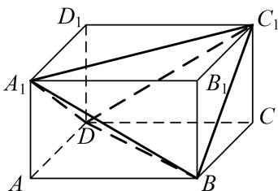

<!-- source-part:1 pages:1-3 -->

## 专题二 对棱相等模型

## 【方法总结】

对棱相等模型是三棱锥的三组对棱长分别相等模型，用构造法(构造长方体)解决．外接球的直径等于长方体的体对角线长，即 $2R=\sqrt{a^{2}+b^{2}+c^{2}}$ (长方体的长、宽、高分别为 a、b、c). 秒杀公式： $R^{2}=\frac{x^{2}+y^{2}+z^{2}}{8}$ (三棱锥的三组对棱长分别为 x、y、z). 可求出球的半径从而解决问题.

## 【例题选讲】

[例]
(1)正四面体的各条棱长都为 $\sqrt{2}$ ，则该正面体外接球的体积为 \_\_\_\_.

答案 $\frac{\sqrt{3}}{2}\pi$ 解析这是特殊情况，但也是对棱相等的模式，放入长方体中， $2R = \sqrt{3}$ ， $R = \frac{\sqrt{3}}{2}$ $V = \frac{4}{3}\pi \cdot \frac{3\sqrt{3}}{8} = \frac{\sqrt{3}}{2}\pi .$

(2)在三棱锥 A-BCD 中，AB=CD=2，AD=BC=3，AC=BD=4，则三棱锥 A-BCD 外接球的表面积为 \_\_\_\_.

答案 $\frac{29}{2}\pi$ 解析 构造长方体, 三个长度为三对面的对角线长, 设长宽高分别为 $a, b, c$ , 则 $a^2 + b^2 = 9$ $b^2 + c^2 = 4$ , $c^2 + a^2 = 16$ $\therefore 2(a^2 + b^2 + c^2) = 9 + 4 + 16 = 29$ , $2(a^2 + b^2 + c^2) = 9 + 4 + 16 = 29$ , $a^2 + b^2 + c^2 = \frac{29}{2}$ , $4R^2 = \frac{29}{2}$ , $S = \frac{29}{2}\pi$ .

(3)在三棱锥 A-BCD 中，AB=CD=6，AC=BD=AD=BC=5，则该三棱锥的外接球的体积为 \_\_\_\_。

答案 $\frac{43\sqrt{43}\pi}{6}$ 解析 依题意得，该三棱锥的三组对棱分别相等，因此可将该三棱锥补形成一个长方体，设该长方体的长、宽、高分别为 a、b、c，且其外接球的半径为 R，则 $\left\{\begin{aligned}a^{2}+b^{2}&=6^{2},\\ b^{2}+c^{2}&=5^{2},\\ c^{2}+a^{2}&=5^{2},\end{aligned}\right.$ 得 $a^{2}+b^{2}+c^{2}=43$ ，即 $(2R)^{2}=a^{2}+b^{2}+c^{2}=43$ ，易知 $R=\frac{\sqrt{43}}{2}$ ，即为该三棱锥的外接球的半径，所以该三棱锥的外接球的表面积为 $\frac{4}{3}\pi R^{3}=\frac{43\sqrt{43}\pi}{6}$ .

(4)在正四面体 A-BCD 中，E 是棱 AD 的中点，P 是棱 AC 上一动点， $BP+PE$ 的最小值为 $\sqrt{7}$ ，则该正四面体的外接球的体积是（）

A. $\sqrt{6}\pi$ B. $6\pi$ C. $\frac{3\sqrt{6}}{32}\pi$ D. $\frac{3}{2}\pi$

答案 A 解析 将侧面 $\Delta ABC$ 和 $\Delta ACD$ 展成平面图形，如图所示：设正四面体的棱长为 a，则

$BP + PE$ 的最小值为 $BE = \sqrt{a^2 + \frac{a^2}{4} - 2a \cdot \frac{1}{2} a \cos 120^\circ} = \frac{\sqrt{7}}{2} a = \sqrt{7}$ ， $\therefore a = 2$ 。在正四面体 $A - BCD$ 的边长为 2，外接球的半径 $R = \frac{\sqrt{6}}{4} a = \frac{\sqrt{6}}{2}$ ，外接球的体积 $V = \frac{4}{3} \pi R^3 = \sqrt{6} \pi$ 。

(5)已知三棱锥 A-BCD，三组对棱两两相等，且 AB=CD=1， $AB=BC=\sqrt{3}$ ，若三棱锥 A-BCD 的外接球表面积为 $\frac{9\pi}{2}$ 。则 AC= \_\_\_\_.

答案 $\sqrt{5}$ 解析 将四面体 $A - BCD$ 放置于长方体中， $\because$ 四面体 $A - BCD$ 的顶点为长方体八个顶点中的四个， $\therefore$ 长方体的外接球就是四面体 $A - BCD$ 的外接球， $\because AB = CD = 1$ ， $AD = BC = \sqrt{3}$ ，且三组对棱两两相等， $\therefore$ 设 $AC = BD = x$ ，得长方体的对角线长为 $\sqrt{\frac{1}{2} [1^2 + (\sqrt{3})^2 + x^2]} = \sqrt{\frac{1}{2} (4 + x^2)}$ ，可得外接球的直径 $2R = \sqrt{\frac{1}{2} (4 + x^2)}$ ，所以 $R = \frac{\sqrt{2(4 + x^2)}}{4}$ ， $\because$ 三棱锥 $A - BCD$ 的外接球表面积为 $\frac{9\pi}{2}$ ， $\therefore 4\pi R^2 = \frac{9\pi}{2}$ ，解得 $R = \frac{3\sqrt{2}}{4}$ ，即 $\frac{\sqrt{2(4 + x^2)}}{4} = \frac{3\sqrt{2}}{4}$ ，解之得 $x = \sqrt{5}$ ，因即 $AC = BD = \sqrt{5}$ .

## 【对点训练】

![[高中/总复习/专题/几何体的外接球与内切球10大模型/专题2 对棱相等模型-几何体的外接球与内切球10大模型/专题2_对棱相等模型/对点训练/Q00039955.md]]
![[高中/总复习/专题/几何体的外接球与内切球10大模型/专题2 对棱相等模型-几何体的外接球与内切球10大模型/专题2_对棱相等模型/对点训练/Q00039956.md]]
![[高中/总复习/专题/几何体的外接球与内切球10大模型/专题2 对棱相等模型-几何体的外接球与内切球10大模型/专题2_对棱相等模型/对点训练/Q00039957.md]]
![[高中/总复习/专题/几何体的外接球与内切球10大模型/专题2 对棱相等模型-几何体的外接球与内切球10大模型/专题2_对棱相等模型/对点训练/Q00039958.md]]
![[高中/总复习/专题/几何体的外接球与内切球10大模型/专题2 对棱相等模型-几何体的外接球与内切球10大模型/专题2_对棱相等模型/对点训练/Q00039959.md]]
![[高中/总复习/专题/几何体的外接球与内切球10大模型/专题2 对棱相等模型-几何体的外接球与内切球10大模型/专题2_对棱相等模型/对点训练/Q00039960.md]]
