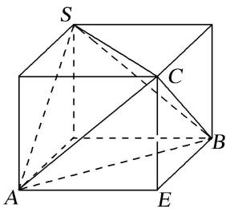

> [!faq]- 《专题2 对棱相等模型-几何体的外接球与内切球10大模型》例题解析
>
> > [!success]- **【答案】** 详见解析
>
> > [!note]- **【解析】**
> > 答案 $14\pi$ 解析 如图，在长方体中，设 $AE = a, BE = b, CE = c$ . 则 $SC = AB = \sqrt{a^2 + b^2} = \sqrt{10}, SA = BC = \sqrt{b^2 + c^2} = \sqrt{13}, SB = AC = \sqrt{a^2 + c^2} = \sqrt{5}$ ，从而 $a^2 + b^2 + c^2 = 14 = (2R)^2$ ，可得 $S = 4\pi R^2 = 14\pi$ . 故所求三棱锥的外接球的表面积为 $14\pi$ .
> >
> > 
