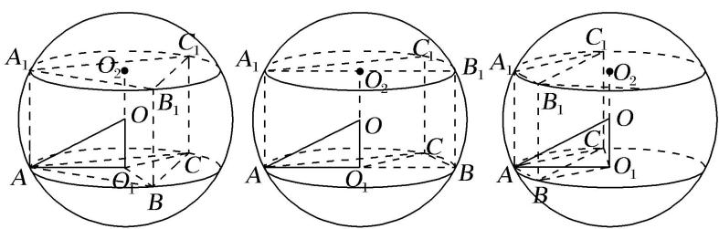
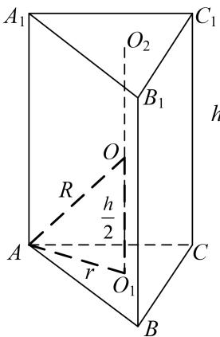
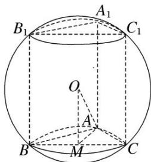
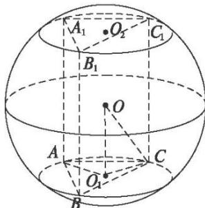

<!-- source-part:1 pages:1-5 -->

## 专题三 汉堡模型

## 【方法总结】

汉堡模型是直棱柱的外接球、圆柱的外接球模型，用找球心法(多面体的外接球的球心是过多面体的两个面的外心且分别垂直这两个面的直线的交点．一般情况下只作出一个面的垂线，然后设出球心用算术方法或代数方法即可解决问题．有时也作出两条垂线，交点即为球心．)解决．以直三棱柱为例，模型如下图，由对称性可知球心 O 的位置是 $\triangle ABC$ 的外心 $O_{1}$ 与 $\triangle A_{1}B_{1}C_{1}$ 的外心 $O_{2}$ 连线的中点，算出小圆 $O_{1}$ 的半径 $AO_{1}=r,\quad OO_{1}=\frac{h}{2},\quad\therefore R^{2}=r^{2}+\frac{h^{2}}{4}$ .

【例题选讲】

[例]
(1)(2013 辽宁)已知直三棱柱 $ABC-A_{1}B_{1}C_{1}$ 的 6 个顶点都在球 O 的球面上．若 AB=3, AC=4, $AB \perp AC$ , $AA_{1}=12$ ，则球 O 的半径为( ).

A. $\frac{3\sqrt{17}}{2}$ B. $2\sqrt{10}$ C. $\frac{13}{2}$ D. $3\sqrt{10}$

答案 C 解析 如图所示，由球心作平面 ABC 的垂线，则垂足为 BC 的中点 M. 又 $AM=\frac{1}{2}BC=\frac{5}{2}$ ， $OM=\frac{1}{2}AA_{1}=6$ ，所以球 O 的半径 $R=OA=\sqrt{\left(\frac{5}{2}\right)^{2}+6^{2}}=\frac{13}{2}$ .

另解 过 C 点作 AB 的平行线，过 B 点作 AC 的平行线，交点为 D，同理过 $C_{1}$ 作 $A_{1}B_{1}$ 的平行线，过 $B_{1}$ 作 $A_{1}C_{1}$ 的平行线，交点为 $D_{1}$ ，连接 $DD_{1}$ ，则 $ABCD-A_{1}B_{1}C_{1}D_{1}$ 恰好成为球的一个内接长方体，故球的半径 $r=\frac{\sqrt{3^{2}+4^{2}+12^{2}}}{2}=\frac{13}{2}$ 。故选 C.

(2)设三棱柱的侧棱垂直于底面，所有棱长都为 $a$ ，顶点都在一个球面上，则该球的表面积为( ).A. $\pi a^{2}$ B. $\frac{7}{3}\pi a^{2}$ C. $\frac{11}{3}\pi a^{2}$ D. $\frac{3}{7}\pi a^{2}$

答案 B 解析 $R^{2}=OB^{2}=OE^{2}+BE^{2}=\frac{a^{2}}{4}+\frac{a^{2}}{3}=\frac{7}{12}a^{2}$ ，∴ $S=4\pi a^{2}=\frac{7}{3}\pi a^{2}$ ．故选 B.

(3)(2009全国Ⅰ)直三棱柱 $ABC-A_{1}B_{1}C_{1}$ 的各顶点都在同一球面上,若 $AB=AC=AA_{1}=2,\angle BAC=120^{\circ}$ ,则此球的表面积等于(). A. $10\pi$ B. $20\pi$ C. $30\pi$ D. $40\pi$

答案 B 解析 如图，先由余弦定理求出 $BC=2\sqrt{3}$ ，再由正弦定理求出 $r=AO_{1}=2$ ，外接球的直径 $R=\sqrt{1^{2}+2^{2}}=\sqrt{5}$ ，所以该球的表面积为 $4\pi R^{2}=20\pi$ 。故选 B.

(4)已知圆柱的高为2，底面半径为 $\sqrt{3}$ ，若该圆柱的两个底面的圆周都在同一个球面上，则这个球的表面积等于（ ）A. $4\pi$ B. $\frac{16\pi}{3}$ C. $\frac{32\pi}{3}$ D. $16\pi$

答案 D 解析 由题意知圆柱的中心 O 为这个球的球心，于是，球的半径 $r=OB=\sqrt{OA^{2}+AB^{2}}=\sqrt{1^{2}+(\sqrt{3})^{2}}=2$ 。故这个球的表面积 $S=4\pi r^{2}=16\pi$ 。故选 D.

(5)若一个圆柱的表面积为 $12\pi$ ，则该圆柱的外接球的表面积的最小值为（ ）A. $(12\sqrt{5} - 12)\pi$ B. $12\sqrt{3}\pi$ C. $(12\sqrt{3} + 3)\pi$ D. $16\pi$

答案 A 解析 设圆柱的底面半径为 $r$ ，高为 $h$ ，则 $2\pi r^2 + 2\pi rh = 12\pi$ ，则 $h = \frac{6}{r} - r$ 。设该圆柱的外接球的半径为 $R$ ，则 $R^2 = r^2 + (\frac{h}{2})^2 = r^2 + \frac{1}{4} (\frac{6}{r} - r)^2 = \frac{5}{4} r^2 + \frac{9}{r^2} - 3 \geqslant 2\sqrt{\frac{5}{4} r^2 \cdot \frac{9}{r^2}} - 3 = 3\sqrt{5} - 3$ ，当且仅当 $\frac{5}{4} r^2 = \frac{9}{r^2}$ ，即 $r^4 = \frac{36}{5}$ 时，等号成立。故该圆柱的外接球的表面积的最小值为 $4\pi (3\sqrt{5} - 3) = (12\sqrt{5} - 12)\pi$ 。

## 【对点训练】

![[高中/总复习/专题/几何体的外接球与内切球10大模型/专题3 汉堡模型-几何体的外接球与内切球10大模型/专题3_汉堡模型/对点训练/Q00039961.md]]
![[高中/总复习/专题/几何体的外接球与内切球10大模型/专题3 汉堡模型-几何体的外接球与内切球10大模型/专题3_汉堡模型/对点训练/Q00039962.md]]
![[高中/总复习/专题/几何体的外接球与内切球10大模型/专题3 汉堡模型-几何体的外接球与内切球10大模型/专题3_汉堡模型/对点训练/Q00039963.md]]
![[高中/总复习/专题/几何体的外接球与内切球10大模型/专题3 汉堡模型-几何体的外接球与内切球10大模型/专题3_汉堡模型/对点训练/Q00039964.md]]
![[高中/总复习/专题/几何体的外接球与内切球10大模型/专题3 汉堡模型-几何体的外接球与内切球10大模型/专题3_汉堡模型/对点训练/Q00039965.md]]
![[高中/总复习/专题/几何体的外接球与内切球10大模型/专题3 汉堡模型-几何体的外接球与内切球10大模型/专题3_汉堡模型/对点训练/Q00039966.md]]
![[高中/总复习/专题/几何体的外接球与内切球10大模型/专题3 汉堡模型-几何体的外接球与内切球10大模型/专题3_汉堡模型/对点训练/Q00039967.md]]
![[高中/总复习/专题/几何体的外接球与内切球10大模型/专题3 汉堡模型-几何体的外接球与内切球10大模型/专题3_汉堡模型/对点训练/Q00039968.md]]
![[高中/总复习/专题/几何体的外接球与内切球10大模型/专题3 汉堡模型-几何体的外接球与内切球10大模型/专题3_汉堡模型/对点训练/Q00039969.md]]
![[高中/总复习/专题/几何体的外接球与内切球10大模型/专题3 汉堡模型-几何体的外接球与内切球10大模型/专题3_汉堡模型/对点训练/Q00039970.md]]
