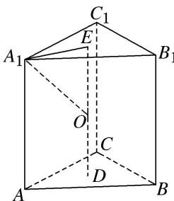

> [!faq]- 《专题3 汉堡模型-几何体的外接球与内切球10大模型》例题解析
>
> > [!success]- **【答案】** C
>
> > [!note]- **【分析】**
> > 本题未单列分析。
>
> > [!note]- **【解析】**
> > 答案 C 解析 如图所示，设底面边长为 $a$ ，则底面面积为 $\frac{\sqrt{3}}{4} a^2 = \frac{3\sqrt{3}}{4}$ ，所以 $a = \sqrt{3}$ . 又一个侧面的周长为 $6\sqrt{3}$ ，所以 $AA_1 = 2\sqrt{3}$ . 设 $E, D$ 分别为上、下底面的中心，连接 $DE$ ，设 $DE$ 的中点为 $O$ ，则点 $O$ 即为正三棱柱 $ABC - A_1B_1C_1$ 的外接球的球心，连接 $OA_1, A_1E$ ，则 $OE = \sqrt{3}, A_1E = \sqrt{3} \times \frac{\sqrt{3}}{2} \times \frac{2}{3} = 1$ . 在直角三角形 $OEA_1$ 中， $OA_1 = \sqrt{1^2 + (\sqrt{3})^2} = 2$ ，即外接球的半径 $R = 2$ ，所以外接球的表面积 $S = 4\pi R^2 = 16\pi$ ，故选 C.
> >
> > 
