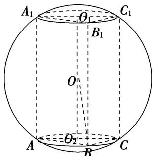

> [!faq]- 《专题3 汉堡模型-几何体的外接球与内切球10大模型》例题解析
>
> > [!success]- **【答案】** B
>
> > [!note]- **【分析】**
> > 本题未单列分析。
>
> > [!note]- **【解析】**
> > 答案 B 解析 设 $\triangle A_{1}B_{1}C_{1}$ 的外心为 $O_{1}$ , $\triangle ABC$ 的外心为 $O_{2}$ , 连接 $O_{1}O_{2}$ , $O_{2}B$ , $OB$ , 如图所示.
> >
> > 
> >
> > 由题意可得外接球的球心 O 为 $O_{1}O_{2}$ 的中点. 在 $\triangle ABC$ 中, 由余弦定理可得 $BC^{2}=AB^{2}+AC^{2}-2AB\times AC\cos\angle BAC=3^{2}+1^{2}-2\times3\times1\times\cos60^{\circ}=7$ , 所以 $BC=\sqrt{7}$ , 由正弦定理可得 $\triangle ABC$ 外接圆的直径 $2r=2O_{2}B=\frac{BC}{\sin60^{\circ}}=\frac{2\sqrt{7}}{\sqrt{3}}$ , 所以 $r=\frac{\sqrt{7}}{\sqrt{3}}=\frac{\sqrt{21}}{3}$ , 而球心 O 到截面 ABC 的距离 $d=OO_{2}=\frac{1}{2}AA_{1}=1$ , 设直三棱柱 ABC-A₁B₁C₁ 的外接球半径为 R, 由球的截面性质可得 $R^{2}=d^{2}+r^{2}=1^{2}+\left(\frac{\sqrt{21}}{3}\right)^{2}=\frac{10}{3}$ , 故 $R=\frac{\sqrt{30}}{3}$ , 所以该三棱柱的外接球的体积为 $V=\frac{4\pi}{3}R^{3}=\frac{40\sqrt{30}\pi}{27}$ .
> >
> > 故选 **B**.
