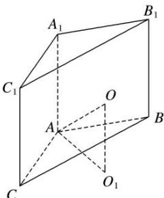

> [!faq]- 《专题3 汉堡模型-几何体的外接球与内切球10大模型》例题解析
>
> > [!success]- **【答案】** A
>
> > [!note]- **【解析】**
> > 答案 A 解析 设 $\triangle ABC$ 外接圆圆心为 $O_{1}$ , 半径为 $r$ , 连接 $O_{1}O$ , 如图, 易得 $O_{1}O \perp$ 平面 $ABC$ ,
> >
> > 
> >
> > $\because AB = AC = 1, AA_{1} = 2\sqrt{3}, \angle BAC = \frac{2\pi}{3}, \therefore 2r = \frac{AB}{\sin\angle ACB} = \frac{1}{\frac{1}{2}} = 2$ ，即 $O_{1}A = 1, O_{1}O = \frac{1}{2} AA_{1} = \sqrt{3}, \therefore OA = \sqrt{O_{1}O^{2} + O_{1}A^{2}} = \sqrt{3 + 1} = 2, \therefore$ 球 $O$ 的体积 $V = \frac{4}{3}\pi \cdot OA^{3} = \frac{32\pi}{3}$ .
> >
> > 故选 **A**.
