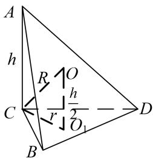
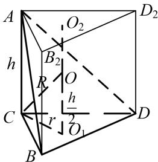
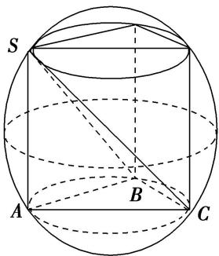
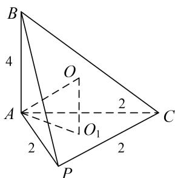
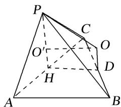
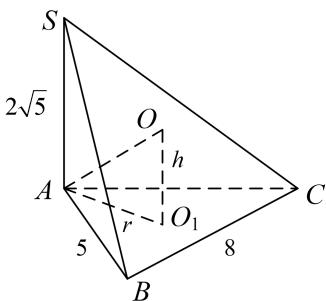
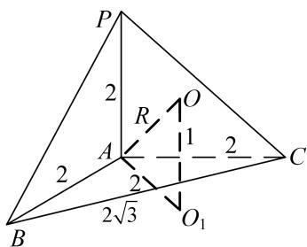
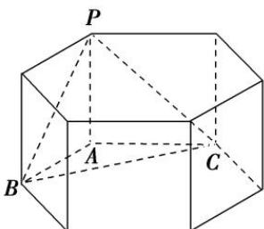

<!-- source-part:1 pages:1-6 -->

## 专题四 垂面模型

## 【方法总结】

垂面模型是有一条侧棱垂直底面的棱锥模型，可补为直棱柱内接于球，由对称性可知球心 O 的位置是 $\triangle CBD$ 的外心 $O_{1}$ 与 $\triangle AB_{2}D_{2}$ 的外心 $O_{2}$ 连线的中点，算出小圆 $O_{1}$ 的半径 $AO_{1}=r, OO_{1}=\frac{h}{2}, \therefore R^{2}=r^{2}+\frac{h^{2}}{4}$ .

## 【例题选讲】

[例]
(1)已知在三棱锥 S-ABC 中，SA⊥平面 ABC，且 $\angle ACB=30^{\circ}$ ， $AC=2AB=2\sqrt{3}$ ，SA=1。则该三棱锥的外接球的体积为( )

A. $\frac{13}{8}\sqrt{13}\pi$ B. $13\pi$ C. $\frac{\sqrt{13}}{6}\pi$ D. $\frac{13\sqrt{13}}{6}\pi$

答案 D 解析 $\because \angle ACB = 30^{\circ}, AC = 2AB = 2\sqrt{3}, \therefore \triangle ABC$ 是以 $AC$ 为斜边的直角三角形，其外接圆半径 $r = \frac{AC}{2} = \sqrt{3}$ ，则三棱锥外接球即为以 $\triangle ABC$ 为底面，以 $SA$ 为高的三棱柱的外接球， $\therefore$ 三棱锥外接球的半径 $R$ 满足 $R = \sqrt{r^{2} + \left(\frac{SA}{2}\right)^{2}} = \frac{\sqrt{13}}{2}$ ，故三棱锥外接球的体积 $V = \frac{4}{3}\pi R^{3} = \frac{13\sqrt{13}}{6}\pi$ 。故选 D.

  
第
(1)小题图

  
第
(2)小题图1

  
第
(2)小题图 2

(2)三棱锥 P-ABC 中，平面 $PAC \perp$ 平面 ABC， $AB \perp AC$ ，PA = PC = AC = 2，AB = 4，则三棱锥 P-ABC 的外接球的表面积为（）

A. $23\pi$ B. $\frac{23}{4}\pi$ C. $64\pi$ D. $\frac{64}{3}\pi$

答案 D 解析 如图 1, 设 O 为三棱锥外接球的球心, $O_{1}$ 为正 $\triangle PAC$ 的中心, 则 $OO_{1}=\frac{1}{2}AB=2.2AO_{1}=\frac{2}{\sin\frac{\pi}{3}}=\frac{4\sqrt{3}}{3}$ , $AO_{1}=\frac{2\sqrt{3}}{3}$ , $R^{2}=OA^{2}=O_{1}A^{2}+O_{1}O^{2}=\frac{4}{3}+4=\frac{16}{3}$ , 故几何体外接球的表面积 $S=4\pi R^{2}=\frac{64}{3}\pi$ .

另解：如图2，设 $O'$ 为正 $\triangle PAC$ 的中心， $D$ 为 Rt $\triangle ABC$ 斜边的中点， $H$ 为 $AC$ 中点．由平面 $PAC \perp$ 平面 $ABC$ ，则 $O'H \perp$ 平面 $ABC$ ．作 $O'O \parallel HD, OD \parallel O'H$ ，则交点 $O$ 为三棱锥外接球的球心，连接 $OP$ ，又 $O'P$ $= \frac{2}{3} PH = \frac{2}{3}\times \frac{\sqrt{3}}{2}\times 2 = \frac{2\sqrt{3}}{3},OO^{\prime} = DH = \frac{1}{2} AB = 2.\therefore R^{2} = OP^{2} = O^{\prime}P^{2} + O^{\prime}O^{2} = \frac{4}{3} +4 = \frac{16}{3}.$ 故几何体外接球的表面积 $S = 4\pi R^2 = \frac{64}{3}\pi .$

(3)在三棱锥 S-ABC 中，侧棱 $SA \perp$ 底面 ABC，AB=5，BC=8， $\angle ABC=60^{\circ}$ ， $SA=2\sqrt{5}$ ，则该三棱锥的外接球的表面积为( )

A. $\frac{64}{3}\pi$ B. $\frac{256}{3}\pi$ C. $\frac{436}{3}\pi$ D. $\frac{2048\sqrt{3}}{27}\pi$

答案 B 解析 由题意知， $AB=5, BC=8, \angle ABC=60^{\circ}$ ，则在 $\triangle ABC$ 中，由余弦定理得 $AC^{2}=AB^{2}+BC^{2}-2\times AB\times BC\times\cos\angle ABC$ ，解得AC=7，设 $\triangle ABC$ 的外接圆半径为r，则 $\triangle ABC$ 的外接圆直径 $2r=\frac{AC}{\sin\angle ABC}=\frac{7}{\sqrt{3}}, \therefore r=\frac{7}{\sqrt{3}}$ ，又∵侧棱SA⊥底面ABC，∴三棱锥的外接球的球心到平面ABC的距离 $h=\frac{1}{2}SA=\sqrt{5}$ ，则外接球的半径 $R=\sqrt{\left(\frac{7}{\sqrt{3}}\right)^{2}+(\sqrt{5})^{2}}=\sqrt{\frac{64}{3}}$ ，则该三棱锥的外接球的表面积为 $S=4\pi R^{2}=\frac{256}{3}\pi$ .

(4)在三棱锥P-ABC中，已知PA⊥底面ABC， $\angle BAC=120^{\circ}, PA=AB=AC=2$ ，若该三棱锥的顶点都在同一个球面上，则该球的表面积为( )

A. $10\sqrt{3}\pi$ B. $18\pi$ C. $20\pi$ D. $9\sqrt{3}\pi$

答案 C 解析 如图 1，先由余弦定理求出 $BC=2\sqrt{3}$ ，再由正弦定理求出 $r=AO_{1}=2$ ，外接球的直径 $R=\sqrt{1^{2}+2^{2}}=\sqrt{5}$ ，所以该球的表面积为 $4\pi R^{2}=20\pi$ .

  
第
(3)小题图

  
第
(4)小题图1

  
第
(4)小题图2

另解 如图 2，该三棱锥为图中正六棱柱内的三棱锥 P-ABC，PA=AB=AC=2，所以该三棱锥的外接球即该六棱柱的外接球，所以外接球的直径 $2R=\sqrt{4^{2}+2^{2}}=2\sqrt{5}\Rightarrow R=\sqrt{5}$ ，所以该球的表面积为 $4\pi R^{2}=20\pi$ .

(5)在三棱锥 P-ABC 中， $PA \perp$ 平面 ABC， $\angle BAC = 120^{\circ}$ ，AC = 2，AB = 1，设 D 为 BC 中点，且直线 PD 与平面 ABC 所成角的余弦值为 $\frac{\sqrt{5}}{5}$ ，则该三棱锥外接球的表面积为 \_\_\_\_.

答案 $\frac{37}{3}\pi$ 解析 在 $\Delta ABC$ 中， $\angle BAC = 120^{\circ}$ ， $AC = 2$ ， $AB = 1$ ，由余弦定理得： $BC^{2} = AC^{2} + AB^{2} - 2AC \cdot BC \cdot \cos \angle BAC$ ，即 $BC^{2} = 2^{2} + 1^{2} - 2 \times 2 \times 1 \times \cos 120^{\circ} = 7$ ，解得： $BC = \sqrt{7}$ 。设 $\Delta ABC$ 的外接圆半径为 $r$ ，由正弦定理得 $2r = \frac{BC}{\sin \angle BAC} = \frac{\sqrt{7}}{\sin 120^{\circ}} = \frac{2\sqrt{7}}{\sqrt{3}}$ 解得： $r = \frac{\sqrt{7}}{\sqrt{3}} = \frac{\sqrt{21}}{3}$ ；且 $\cos \angle ABC = \frac{AB^{2} + BC^{2} - AC^{2}}{2AB \cdot BC} = \frac{1^{2} + (\sqrt{7})^{2} - 2^{2}}{2 \times 1 \times \sqrt{7}} = \frac{2\sqrt{7}}{7}$ ，又 $D$ 为 $BC$ 中点，在 $\Delta ABD$ 中， $BD = \frac{1}{2} BC = \frac{\sqrt{7}}{2}$ ， $AB = 1$ ， $\cos \angle ABD = \frac{2\sqrt{7}}{7}$ 。由余弦定理得： $AD^{2} = AB^{2} + BD^{2} - 2AB\cdot BD\cos \angle ABD$ ，即： $AD^{2} = 1^{2} + (\frac{\sqrt{7}}{2})^{2} - 2\times 1\times \frac{\sqrt{7}}{2}\times \frac{2\sqrt{7}}{7} = \frac{3}{4}$ ，解得 $AD = \frac{\sqrt{3}}{2}$ .又因为 $PA\bot$ 平面ABC，所以∠PDA为直线PD与平面ABC所成角，由 $\cos \angle PDA = \frac{\sqrt{5}}{5}$ ，得 $\sin \angle PDA = \frac{2\sqrt{5}}{5}$ ， $\tan \angle PDA = 2$ ，所以在Rt△PAD中， $PA = AD\cdot \tan \angle PDA = \frac{\sqrt{3}}{2}\cdot 2 = \sqrt{3}$ .设三棱锥 $P - ABC$ 的外接球半径为 $R$ ，所以 $R = \sqrt{\left(\frac{PA}{2}\right)^2 + r^2} = \sqrt{\left(\frac{\sqrt{3}}{2}\right)^2 + \left(\frac{\sqrt{21}}{3}\right)^2} = \sqrt{\frac{37}{12}}$ ，三棱锥 $P - ABC$ 外接球表面积为 $S = 4\pi R^2 = \frac{37}{3}\pi .$

## 【对点训练】

![[高中/总复习/专题/几何体的外接球与内切球10大模型/专题4 垂面模型-几何体的外接球与内切球10大模型/专题4_垂面模型/对点训练/Q00039971.md]]
![[高中/总复习/专题/几何体的外接球与内切球10大模型/专题4 垂面模型-几何体的外接球与内切球10大模型/专题4_垂面模型/对点训练/Q00039972.md]]
![[高中/总复习/专题/几何体的外接球与内切球10大模型/专题4 垂面模型-几何体的外接球与内切球10大模型/专题4_垂面模型/对点训练/Q00039973.md]]
![[高中/总复习/专题/几何体的外接球与内切球10大模型/专题4 垂面模型-几何体的外接球与内切球10大模型/专题4_垂面模型/对点训练/Q00039974.md]]
![[高中/总复习/专题/几何体的外接球与内切球10大模型/专题4 垂面模型-几何体的外接球与内切球10大模型/专题4_垂面模型/对点训练/Q00039975.md]]
![[高中/总复习/专题/几何体的外接球与内切球10大模型/专题4 垂面模型-几何体的外接球与内切球10大模型/专题4_垂面模型/对点训练/Q00039976.md]]
![[高中/总复习/专题/几何体的外接球与内切球10大模型/专题4 垂面模型-几何体的外接球与内切球10大模型/专题4_垂面模型/对点训练/Q00039977.md]]
![[高中/总复习/专题/几何体的外接球与内切球10大模型/专题4 垂面模型-几何体的外接球与内切球10大模型/专题4_垂面模型/对点训练/Q00039978.md]]
![[高中/总复习/专题/几何体的外接球与内切球10大模型/专题4 垂面模型-几何体的外接球与内切球10大模型/专题4_垂面模型/对点训练/Q00039979.md]]
![[高中/总复习/专题/几何体的外接球与内切球10大模型/专题4 垂面模型-几何体的外接球与内切球10大模型/专题4_垂面模型/对点训练/Q00039980.md]]
![[高中/总复习/专题/几何体的外接球与内切球10大模型/专题4 垂面模型-几何体的外接球与内切球10大模型/专题4_垂面模型/对点训练/Q00039981.md]]
