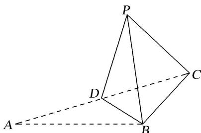

<!-- question-source:start -->
6. 如图, 在 $\triangle ABC$ 中, $AB = BC = \sqrt{6}$ , $\angle ABC = 90^{\circ}$ , 点 $D$ 为 $AC$ 的中点, 将 $\triangle ABD$ 沿 $BD$ 折起到 $\triangle PBD$ 的位置, 使 $PC = PD$ , 连接 $PC$ , 得到三棱锥 $P - BCD$ , 若该三棱锥的所有顶点都在同一球面上, 则该球的表面积是( )

A. $7\pi$ B. $5\pi$ C. $3\pi$ D. $\pi$
<!-- question-source:end -->

![[高中/总复习/专题/几何体的外接球与内切球10大模型/专题4 垂面模型-几何体的外接球与内切球10大模型/专题4_垂面模型/对点训练/answers/Q00039976A1.md]]
