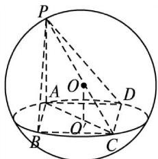

<!-- question-source:start -->
7. 如图所示，∵ $PA \perp$ 平面 ABCD，∴ $PA \perp AC$ 。故可知 PC 为球 O 直径，则 PC 的中点为 O，取 AC 的中点为 $O'$ ，则 $OO' = \frac{1}{2} PA = \sqrt{6}$ ，又∵ $AC = \sqrt{(2\sqrt{3})^2 + (2\sqrt{3})^2} = 2\sqrt{6}$ ， $PA = 2\sqrt{6}$ ， $PC = \sqrt{(2\sqrt{6})^2 + (2\sqrt{6})^2} = 4\sqrt{3}$ ，∴球半径 $R = 2\sqrt{3}$ ，故 $OC = OA = OB = 2\sqrt{3}$ ，又∵ $AB = 2\sqrt{3}$ ，∴△OAB 为等边三角形．∴ $S_{\triangle OAB} = \frac{1}{2} \times 2\sqrt{3} \times 2\sqrt{3} \times \sin 60^\circ = 3\sqrt{3}$ .

<!-- question-source:end -->
