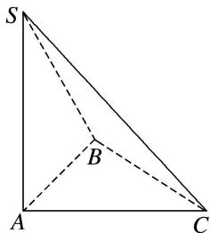
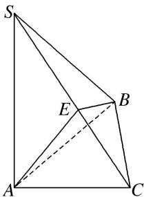

> [!faq]- 《专题4 垂面模型-几何体的外接球与内切球10大模型》例题解析
>
> > [!success]- **【答案】** C
>
> > [!note]- **【分析】**
> > 本题未单列分析。
>
> > [!note]- **【解析】**
> > 答案 C 解析 在 $\triangle ABC$ 中，由余弦定理得， $BC^2 = AB^2 + AC^2 - 2AB \cdot AC \cos 60^\circ = 3$ ， $\therefore AC^2 = AB^2 + BC^2$ ，即 $AB \perp BC$ 。又 $SA \perp$ 平面 $ABC$ ， $\therefore SA \perp AB$ ， $SA \perp BC$ ， $\therefore$ 三棱锥 $S - ABC$ 可补成分别以 $AB = 1$ ， $BC = \sqrt{3}$ ， $SA = 2\sqrt{3}$ 为长、宽、高的长方体， $\therefore$ 球 $O$ 的直径为 $\sqrt{1^2 + (\sqrt{3})^2 + (2\sqrt{3})^2} = 4$ ，故球 $O$ 的表面积为 $4\pi \times 2^2 = 16\pi$ 。
> > 
> > 
> > 另解 取 SC 的中点 E，连接 AE，BE，依题意， $BC^{2}=AB^{2}+AC^{2}-2AB\cdot AC\cos60^{\circ}=3,\therefore AC^{2}=AB^{2}+BC^{2}$ ，即 $AB\perp BC$ ，又 $SA\perp$ 平面 ABC， $\therefore SA\perp BC$ ，又 $SA\cap AB=A,\therefore BC\perp$ 平面 SAB， $BC\perp SB,AE=\frac{1}{2}SC=BE,\therefore$ 点 E 是三棱锥 S-ABC 的外接球的球心，即点 E 与点 O 重合， $OA=\frac{1}{2}SC=\frac{1}{2}\sqrt{SA^{2}+AC^{2}}=2$ ，故球 O 的表面积为 $4\pi\times OA^{2}=16\pi$ 。
