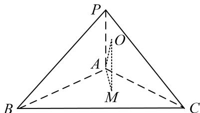

> [!faq]- 《专题4 垂面模型-几何体的外接球与内切球10大模型》例题解析
>
> > [!success]- **【答案】** C
>
> > [!note]- **【分析】**
> > 本题未单列分析。
>
> > [!note]- **【解析】**
> > 答案 C 解析 易知 $\triangle ABC$ 是等边三角形．如图，作 $OM \perp$ 平面 $ABC$ ，其中 $M$ 为 $\triangle ABC$ 的中心，且点 $O$ 满足 $OM = \frac{1}{2} PA = 1$ ，则点 $O$ 为三棱锥 $P - ABC$ 外接球的球心．于是，该外接球的半径 $R = OA = \sqrt{AM^2 + OM^2} = \sqrt{(\frac{\sqrt{3}}{2} \times \sqrt{3} \times \frac{2}{3})^2 + 1^2} = \sqrt{2}$ ．故该球的表面积 $S = 4\pi R^2 = 8\pi$ ，故选 C．
> > 
