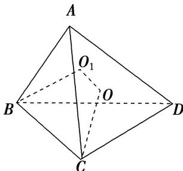

> [!faq]- 《专题4 垂面模型-几何体的外接球与内切球10大模型》例题解析
>
> > [!success]- **【答案】** A
>
> > [!note]- **【分析】**
> > 本题未单列分析。
>
> > [!note]- **【解析】**
> > 答案 A 解析 依题意可得该三棱锥的面 $PCD$ 是边长为 $\sqrt{3}$ 的正三角形，且 $BD \perp$ 平面 $PCD$ ，设三棱锥 $P - BDC$ 外接球的球心为 $O$ ， $\triangle PCD$ 外接圆的圆心为 $O_1$ ，则 $OO_1 \perp$ 平面 $PCD$ ，所以四边形 $OO_1DB$ 为直角梯形，由 $BD = \sqrt{3}$ ， $O_1D = 1$ ，及 $OB = OD$ ，可得 $OB = \frac{\sqrt{7}}{2}$ ，则外接球的半径 $R = \frac{\sqrt{7}}{2}$ 。所以该球的表面积 $S_\text{球} = 4\pi R^2 = 7\pi$ 。
> > 
