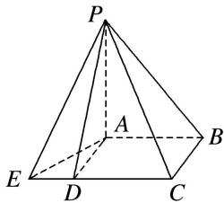

<!-- question-source:start -->
9. 中国古代数学经典《九章算术》系统地总结了战国、秦、汉时期的数学成就，书中将底面为长方形且有一条侧棱与底面垂直的四棱锥称之为阳马，将四个面都为直角三角形的三棱锥称之为鳖臑，如图为一个阳马与一个鳖臑的组合体，已知 $PA \perp$ 平面 $ABCE$ ，四边形 $ABCD$ 为正方形， $AD = \sqrt{5}$ ， $ED = \sqrt{3}$ ，若鳖臑 $P - ADE$ 的外接球的体积为 $9\sqrt{2}\pi$ ，则阳马 $P - ABCD$ 的外接球的表面积为 \_\_\_\_.

<!-- question-source:end -->

![[高中/总复习/专题/几何体的外接球与内切球10大模型/专题4 垂面模型-几何体的外接球与内切球10大模型/专题4_垂面模型_几何体的外接球与内切球10大模型/对点训练/answers/Q00039980A1.md]]
