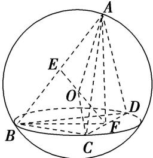

> [!faq]- 《专题5 切瓜模型-几何体的外接球与内切球10大模型》例题解析
>
> > [!success]- **【答案】** 详见解析
>
> > [!note]- **【分析】**
> > 本题未单列分析。
>
> > [!note]- **【解析】**
> > 答案 $\frac{80}{3}\pi$ 解析 取 $AB, CD$ 的中点分别为 $E, F$ , 连接 $EF, AF, BF$ , 由题意知 $AF \perp BF$ , $AF = BF = 2\sqrt{3}$ , $EF = \frac{1}{2}\sqrt{AF^2 + BF^2} = \sqrt{6}$ , 易知三棱锥的外接球球心 $O$ 在线段 $EF$ 上, 所以 $OE + OF = \sqrt{6}$ , 设外接球的半径为 $R$ , 连接 $OA, OC$ , 则有 $R^2 = AE^2 + OE^2$ , $R^2 = CF^2 + OF^2$ , 所以 $AE^2 + OE^2 = CF^2 + OF^2$ , $(\sqrt{6})^2 + OE^2 = 2^2 + OF^2$ , 所以 $OF^2 - OE^2 = 2$ , 又 $OE + OF = \sqrt{6}$ , 则 $OF^2 = \frac{8}{3}$ , $R^2 = \frac{20}{3}$ , 所以该三棱锥外接球的表面积为 $4\pi R^2 = \frac{80}{3}\pi$ .
> > 
