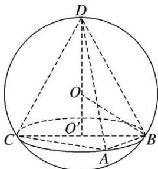

> [!faq]- 《专题5 切瓜模型-几何体的外接球与内切球10大模型》例题解析
>
> > [!success]- **【答案】** C
>
> > [!note]- **【分析】**
> > 本题未单列分析。
>
> > [!note]- **【解析】**
> > 答案 C 解析 如图所示, $\because AB^{2} + AC^{2} = BC^{2}$ , $\therefore \angle CAB$ 为直角, 即 $\triangle ABC$ 外接圆的圆心为 $BC$ 的中点 $O'$ . $\triangle ABC$ 和 $\triangle DBC$ 所在的平面互相垂直, 则球心在过 $\triangle DBC$ 的圆面上, 即 $\triangle DBC$ 的外接圆为球的大圆, 由等边三角形的重心和外心重合, 易得球半径 $R = 2$ , 球的表面积为 $S = 4\pi R^{2} = 16\pi$ , 故选 C.
> > 
