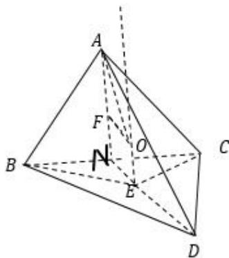

> [!faq]- 《专题5 切瓜模型-几何体的外接球与内切球10大模型》例题解析
>
> > [!success]- **【答案】** D
>
> > [!note]- **【解析】**
> > 答案 D 解析 记 $\Delta BCD$ 外接圆圆心为 E， $\Delta ABC$ 外接圆圆心为 F，连结 OE，OF，则 $OE \perp$ 平面 BCD， $OF \perp$ 平面 ABC；取 BC 中点 N，连结 AN，EN，因为 $\Delta ABC$ 是边长为 2 的正三角形，所以 AN 过点 F，且 $AF = 2FN = \frac{2}{3}AN = \frac{2}{3}\sqrt{3}$ ；在 $\Delta BCD$ 中， $\angle BDC = \frac{\pi}{4}$ ，BC = 2，设 $\Delta BCD$ 外接圆为 r，则 $2r = \frac{BC}{\sin\angle BDC} = \frac{2}{\frac{\sqrt{2}}{2}} = 2\sqrt{2}$ ，所以 $r = \sqrt{2}$ ，故 $BE = EC = r = \sqrt{2}$ ，所以有 $BE^{2} + EC^{2} = BC^{2}$ ，因为 N 为 BC 中点，所以 $EN \perp BC$ ，且 $EN = \frac{1}{2}BC = 1$ ；又平面 $ABC \perp$ 平面 BCD，所以 $EN \perp$ 平面 ABC， $OE \perp$ 平面 ABC；因此 $EN \perp OF$ 且 EN = OF = 1，设三棱锥 A - BCD 外接球半径为 R，则 $R = OA = \sqrt{OF^{2} + AF^{2}}\sqrt{\frac{7}{3}}$ ，因此，球 O 的表面积为 $S = 4\pi R^{2} = \frac{28}{3}\pi$ 。故选 D.
> >
> > 
