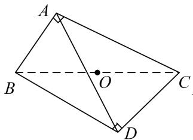
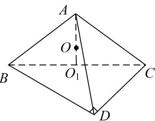
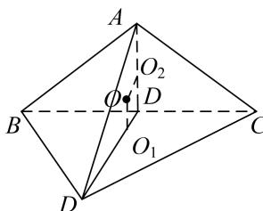
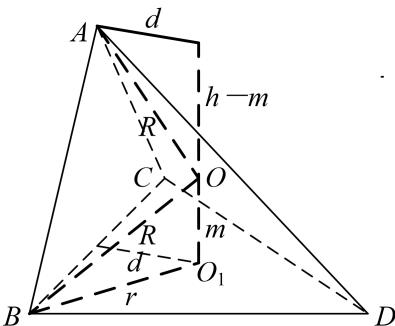
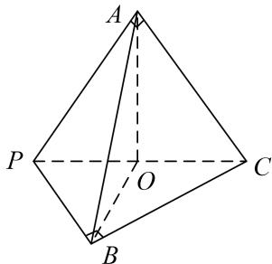
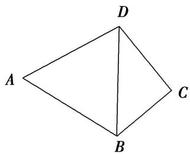
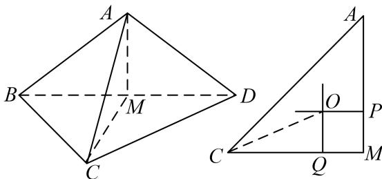
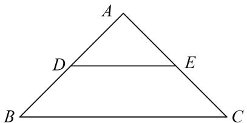
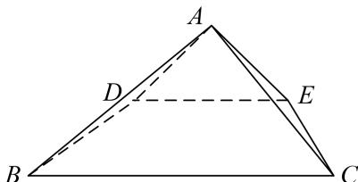
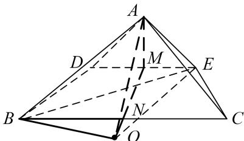

<!-- source-part:1 pages:1-7 -->

## 专题五 切瓜模型

## 【方法总结】

切瓜模型是有一侧面垂直底面的棱锥型，常见的是两个互相垂直的面都是特殊三角形且平面 $ABC \perp$ 平面 $BCD$ ，如类型 I， $\triangle ABC$ 与 $\triangle BCD$ 都是直角三角形，类型 II， $\triangle ABC$ 是等边三角形， $\triangle BCD$ 是直角三角形，类型 III， $\triangle ABC$ 与 $\triangle BCD$ 都是等边三角形，解决方法是分别过 $\triangle ABC$ 与 $\triangle BCD$ 的外心作该三角形所在平面的垂线，交点 O 即为球心。类型 IV， $\triangle ABC$ 与 $\triangle BCD$ 都一般三角形，解决方法是过 $\triangle BCD$ 的外心 $O_1$ 作该三角形所在平面的垂线，用代数方法即可解决问题。设三棱锥 A-BCD 的高为 h，外接球的半径为 R，球心为 O。 $\triangle BCD$ 的外心为 $O_1$ ， $O_1$ 到 BD 的距离为 d，O 与 $O_1$ 的距离为 m，则 $\begin{cases} R^2 = r^2 + m^2, \\ R^2 = d^2 + (h - m)^2, \end{cases}$ 解得 R。可用秒杀公式： $R^2 = r_1^2 + r_2^2 - \frac{l^2}{4}$ （其中 $r_1$ 、 $r_2$ 为两个面的外接圆的半径，l 为两个面的交线的长）。

  
类型Ⅱ

  
类型IV  
【例题选讲】

[例] (1)已知在三棱锥 $P - ABC$ 中， $V_{P - ABC} = \frac{4\sqrt{3}}{3}$ ， $\angle APC = \frac{\pi}{4}$ ， $\angle BPC = \frac{\pi}{3}$ ， $PA \perp AC$ ， $PB \perp BC$ ，且平面 $PAC \perp$ 平面 $PBC$ ，那么三棱锥 $P - ABC$ 外接球的体积为 \_\_\_\_.

答案 $\frac{32\pi}{3}$ 解析 如图，取 $PC$ 的中点 $O$ ，连接 $AO$ ， $BO$ ，设 $PC = 2R$ ，则 $OA = OB = OC = OP = R$ ∴ $O$ 是三棱锥 $P - ABC$ 外接球的球心，易知， $PB = R$ ， $BC = \sqrt{3} R$ ， $\because \angle APC = \frac{\pi}{4}$ ， $PA \perp AC$ ， $O$ 为 $PC$ 的中点，∴ $AO \perp PC$ ，又平面 $PAC \perp$ 平面 $PBC$ ，且平面 $PAC \cap$ 平面 $PBC = PC$ ，∴ $AO \perp$ 平面 $PBC$ ，∴ $V_{P - ABC} = V_{A - PBC} = \frac{1}{3} \times \frac{1}{2} \times PB \times BC \times AO = \frac{1}{3} \times \frac{1}{2} \times R \times \sqrt{3} R \times R = \frac{4\sqrt{3}}{3}$ ，解得 $R = 2$ ，∴三棱锥 $P - ABC$ 外接球的体积 $V = \frac{4}{3}\pi R^3 = \frac{32\pi}{3}$ .

(2)如图, 已知平面四边形 $ABCD$ 满足 $AB = AD = 2$ , $\angle A = 60^{\circ}$ , $\angle C = 90^{\circ}$ , 将 $\triangle ABD$ 沿对角线 $BD$ 翻折,使平面 $ABD \perp$ 平面 $CBD$ , 则四面体 $ABCD$ 外接球的体积为 \_\_\_\_.

答案 $\frac{32\sqrt{3}\pi}{27}$ 解析 在四面体 $ABCD$ 中， $\because AB = AD = 2, \angle BAD = 60^\circ, \therefore \triangle ABD$ 为正三角形，设 $BD$ 的中点为 $M$ ，连接 $AM$ ，则 $AM \perp BD$ ，又平面 $ABD \perp$ 平面 $CBD$ ，平面 $ABD \cap$ 平面 $CBD = BD, \therefore AM \perp$ 平面 $CBD$ . $\because \triangle CBD$ 为直角三角形， $\therefore$ 其外接圆的圆心是斜边 $BD$ 的中点 $M$ ，由球的性质知，四面体 $ABCD$ 外接球的球心必在线段 $AM$ 上，又 $\triangle ABD$ 为正三角形， $\therefore$ 球心是 $\triangle ABD$ 的中心，则外接球的半径为 $\frac{2}{3} \times 2 \times \frac{\sqrt{3}}{2} = \frac{2\sqrt{3}}{3}, \therefore$ 四面体 $ABCD$ 外接球的体积为 $\frac{4}{3} \times \pi \times (\frac{2\sqrt{3}}{3})^3 = \frac{32\sqrt{3}\pi}{27}$ .

(3)已知三棱锥 A-BCD 中， $\triangle ABD$ 与 $\triangle BCD$ 是边长为 2 的等边三角形且二面角 A-BD-C 为直二面角，则三棱锥 A-BCD 的外接球的表面积为( )

A. $\frac{10\pi}{3}$ B. $5\pi$ C. $6\pi$ D. $\frac{20\pi}{3}$

答案 D 解析 如图，取 BD 中点 M，连接 AM，CM，取 $\triangle ABD$ ， $\triangle CBD$ 的中心即 AM，CM 的三等分点 P，Q，过 P 作平面 ABD 的垂线，过 Q 作平面 CBD 的垂线，两垂线相交于点 O，则点 O 为外接球的球心，如图，其中 $OQ=\frac{\sqrt{3}}{3}$ ， $CQ=\frac{2\sqrt{3}}{3}$ ，连接 OC，则外接球的半径 $R=OC=\frac{\sqrt{15}}{3}$ ，表面积为 $4\pi R^{2}=\frac{20\pi}{3}$ ，故选 D.

(4)已知 $\Delta ABC$ 是以 $BC$ 为斜边的直角三角形， $P$ 为平面 $ABC$ 外一点，且平面 $PBC \perp$ 平面 $ABC$ ， $BC = 3$ ， $PB = 2\sqrt{2}$ ， $PC = \sqrt{5}$ ，则三棱锥 $P - ABC$ 外接球的表面积为 \_\_\_\_.

答案 $10\pi$ 解析 由题意知 $BC$ 的中点 $O$ 为 $\Delta ABC$ 外接圆的圆心，且平面 $PBC \perp$ 平面 $ABC$ ，过 $O$ 作面 $ABC$ 的垂线 $l$ ，则垂线 $l$ 一定在面 $ABC$ 内．根据球的性质，球心一定在垂线 $l$ 上， $\because$ 球心 $O_1$ 一定在平面 $PBC$ 内，且球心 $O_1$ 也是 $\Delta PBC$ 外接圆的圆心．在 $\Delta PBC$ 中，由余弦定理得 $\cos \angle PBC = \frac{PB^2 + BC^2 - PC^2}{2PB \cdot BC} = \frac{\sqrt{2}}{2}$ ， $\therefore \sin \angle PBC = \frac{\sqrt{2}}{2}$ ，由正弦定理得： $\frac{PC}{\sin \angle PBC} = 2R$ ，解得 $R = \frac{\sqrt{10}}{2}$ ， $\therefore$ 三棱锥的外接球的表面积 $= 4\pi R^2 = 10\pi$ ．

(5)已知等腰直角三角形 ABC 中，AB = AC = 2，D，E 分别为 AB，AC 的中点，沿 DE 将 $\triangle ABC$ 折成直二面角(如图)，则四棱锥 A - DECB 的外接球的表面积为 \_\_\_\_。

答案 $10\pi$ 解析 取 $DE$ 的中点 $M, BC$ 的中点 $N$ ，连接 $MN$ （图略），由题意知， $MN \perp$ 平面 $ADE$ ，因为 $\triangle ADE$ 是等腰直角三角形，所以 $\triangle ADE$ 的外接圆的圆心是点 $M$ ，四棱锥 $A-DECB$ 的外接球的球心在直线 $MN$ 上，又等腰梯形 $DECB$ 的外接圆的圆心在 $MN$ 上，所以四棱锥 $A-DECB$ 的外接球的球心就是等腰梯形 $DECB$ 的外接圆的圆心。连接 $BE$ ，易知 $\triangle BEC$ 是钝角三角形，所以等腰梯形 $DECB$ 的外接圆的圆心在等腰梯形 $DECB$ 的外部。设四棱锥 $A-DECB$ 的外接球的半径为 $R$ ，球心到 $BC$ 的距离为 $d$ ，则 $\left\{ \begin{array}{l} R^2 = d^2 + (\sqrt{2})^2, \\ R^2 = (d + \frac{\sqrt{2}}{2})^2 + (\frac{\sqrt{2}}{2})^2, \end{array} \right.$ 解得 $R^2 = \frac{5}{2}$ ，故四棱锥 $A-DECB$ 的外接球的表面积 $S = 4\pi R^2 = 10\pi$ 。

## 【对点训练】

![[高中/总复习/专题/几何体的外接球与内切球10大模型/专题5 切瓜模型-几何体的外接球与内切球10大模型/专题5_切瓜模型_几何体的外接球与内切球10大模型/对点训练/Q00039982.md]]
![[高中/总复习/专题/几何体的外接球与内切球10大模型/专题5 切瓜模型-几何体的外接球与内切球10大模型/专题5_切瓜模型_几何体的外接球与内切球10大模型/对点训练/Q00039983.md]]
![[高中/总复习/专题/几何体的外接球与内切球10大模型/专题5 切瓜模型-几何体的外接球与内切球10大模型/专题5_切瓜模型_几何体的外接球与内切球10大模型/对点训练/Q00039984.md]]
![[高中/总复习/专题/几何体的外接球与内切球10大模型/专题5 切瓜模型-几何体的外接球与内切球10大模型/专题5_切瓜模型_几何体的外接球与内切球10大模型/对点训练/Q00039985.md]]
![[高中/总复习/专题/几何体的外接球与内切球10大模型/专题5 切瓜模型-几何体的外接球与内切球10大模型/专题5_切瓜模型_几何体的外接球与内切球10大模型/对点训练/Q00039986.md]]
![[高中/总复习/专题/几何体的外接球与内切球10大模型/专题5 切瓜模型-几何体的外接球与内切球10大模型/专题5_切瓜模型_几何体的外接球与内切球10大模型/对点训练/Q00039987.md]]
![[高中/总复习/专题/几何体的外接球与内切球10大模型/专题5 切瓜模型-几何体的外接球与内切球10大模型/专题5_切瓜模型_几何体的外接球与内切球10大模型/对点训练/Q00039988.md]]
![[高中/总复习/专题/几何体的外接球与内切球10大模型/专题5 切瓜模型-几何体的外接球与内切球10大模型/专题5_切瓜模型_几何体的外接球与内切球10大模型/对点训练/Q00039989.md]]
![[高中/总复习/专题/几何体的外接球与内切球10大模型/专题5 切瓜模型-几何体的外接球与内切球10大模型/专题5_切瓜模型_几何体的外接球与内切球10大模型/对点训练/Q00039990.md]]
![[高中/总复习/专题/几何体的外接球与内切球10大模型/专题5 切瓜模型-几何体的外接球与内切球10大模型/专题5_切瓜模型_几何体的外接球与内切球10大模型/对点训练/Q00039991.md]]
