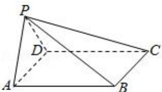

<!-- question-source:start -->
6. 如图，已知四棱锥 $P - ABCD$ 的底面为矩形，平面 $PAD \perp$ 平面 $ABCD$ ， $AD = 2\sqrt{2}$ ， $PA = PD = AB = 2$ 则四棱锥 $P - ABCD$ 的外接球的表面积为（）

A. $2\pi$ B. $4\pi$ C. $8\pi$ D. $12\pi$
<!-- question-source:end -->

![[高中/总复习/专题/几何体的外接球与内切球10大模型/专题5 切瓜模型-几何体的外接球与内切球10大模型/专题5_切瓜模型_几何体的外接球与内切球10大模型/对点训练/answers/Q00039987A1.md]]
