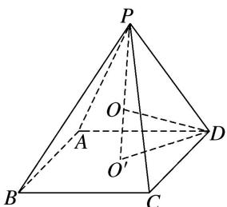

> [!faq]- 《专题6 斗笠模型-几何体的外接球与内切球10大模型》例题解析
>
> > [!success]- **【答案】** C
>
> > [!note]- **【解析】**
> > 答案 C 解析 如图所示, 设底面正方形 $ABCD$ 的中心为 $O'$ , 正四棱锥 $P-ABCD$ 的外接球的球心为 $O$ ,
> >
> > 
> >
> > ∵底面正方形的边长为 $\sqrt{2}$ ，∴ $O'D=1$ ，∵正四棱锥的体积为2，∴ $V_{P-ABCD}=\frac{1}{3}\times(\sqrt{2})^{2}\times PO'=2$ ，解得 $PO'=3$ ，∴ $OO'=|PO'-PO|=|3-R|$ ，在Rt△ $OO'D$ 中，由勾股定理可得 $OO'^{2}+O'D^{2}=OD^{2}$ ，即 $(3-R)^{2}+1^{2}=R^{2}$ ，解得 $R=\frac{5}{3}$ ，∴ $V_{球}=\frac{4}{3}\pi R^{3}=\frac{4}{3}\pi\times\left(\frac{5}{3}\right)^{3}=\frac{500\pi}{81}$ .
