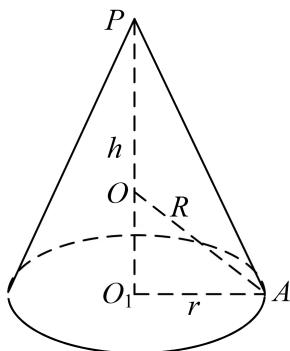
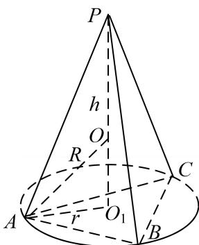
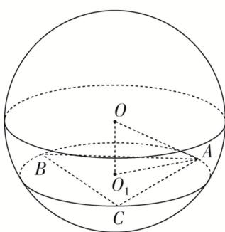
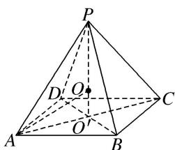
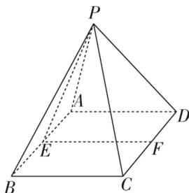
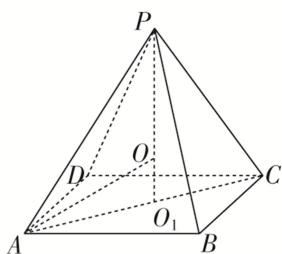

<!-- source-part:1 pages:1-5 -->

## 专题六 斗笠模型

## 【方法总结】

圆锥、顶点在底面的射影是底面外心的棱锥．秒杀公式： $R=\frac{h^{2}+r^{2}}{2h}$ （其中 h 为几何体的高，r 为几何体的底面半径或底面外接圆的圆心）

【例题选讲】

[例] (1)一个圆锥恰有三条母线两两夹角为 $60^{\circ}$ , 若该圆锥的侧面积为 $3 \sqrt{3} \pi$ , 则该圆锥外接球的表面积为 \_\_\_\_.

答案 $\frac{27\pi}{2}$ 解析 设 $\angle ASB = \angle BSC = \angle CSA = 60^{\circ}$ ，则 $SA = SB = SC = AB = AC = BC$ 。设 $AB = x$ ，则底面圆的直径为 $2r = \frac{x}{\sin 60^{\circ}} = \frac{2x}{\sqrt{3}}$ ，该圆锥的侧面积为 $\frac{1}{2}\pi \cdot \frac{2x}{\sqrt{3}} \cdot x = 3\sqrt{3}\pi$ ，解得 $x = 3$ ，高 $OS = \sqrt{3^{2} - (\sqrt{3})^{2}} = \sqrt{6}$ 。 $\therefore r = \frac{3}{\sqrt{3}} = \sqrt{3}$ 。设圆锥外接球的半径为 $R$ ，所以 $(\sqrt{6} - R)^{2} + r^{2} = R^{2}$ ，解得 $R = \frac{3\sqrt{6}}{4}$ ，则外接球的表面积为 $4\pi R^{2} = \frac{27\pi}{2}$ 。

(2)(2020·全国I)已知 A, B, C 为球 O 的球面上的三个点， $\odot O_{1}$ 为 $\triangle ABC$ 的外接圆．若 $\odot O_{1}$ 的面积为 $4\pi$ ， $AB = BC = AC = OO_{1}$ ，则球 O 的表面积为（）A. $64\pi$ B. $48\pi$ C. $36\pi$ D. $32\pi$

答案 A 解析 设 $\odot O_{1}$ 的半径为 $r$ ，球的半径为 $R$ ，依题意，得 $\pi r^{2} = 4\pi, \therefore r = 2$ 。由正弦定理可得 $\frac{AB}{\sin 60^{\circ}} = 2r, \therefore AB = 2r \sin 60^{\circ} = 2\sqrt{3}$ 。 $\therefore OO_{1} = AB = 2\sqrt{3}$ 。根据球的截面性质，得 $OO_{1} \perp$ 平面 $ABC, \therefore OO_{1} \perp O_{1}A, R = OA = \sqrt{OO_{1}^{2} + O_{1}A^{2}} = \sqrt{OO_{1}^{2} + r^{2}} = 4, \therefore$ 球 $O$ 的表面积 $S = 4\pi R^{2} = 64\pi$ 。故选 A.

(3)在三棱锥 $P - ABC$ 中， $PA = PB = PC = 2\sqrt{6}, AC = AB = 4$ ，且 $AC \perp AB$ ，则该三棱锥外接球的表

面积为\_\_\_\_。

答案 36π 解析 设顶点 P 在底面中的射影为 $O_{1}$ ，由于 PA = PB = PC，所以 $O_{1}A = O_{1}B = O_{1}C$ ，即点 $O_{1}$ 是底面 $\Delta ABC$ 的外心，又 $AC \perp AB$ ，所以 $O_{1}$ 为 BC 的中点，因为 $PA = PB = PC = 2\sqrt{6}$ ，AC = AB = 4，所以 $BC = 4\sqrt{2}$ ， $AO_{1} = 2\sqrt{2}$ ， $PO_{1} = 4$ ，设外接球的球心为 O，半径为 R，则 O 必在 $PO_{1}$ 上， $O_{1}O = 4 - R$ ，在 $Rt\Delta O_{1}OA$ 中， $(4 - R)^{2} + (2\sqrt{2})^{2} = R^{2}$ ，解得 R = 3，所以 $S_{2} = 4\pi R^{2} = 36\pi$ 。

(4)正四棱锥的顶点都在同一球面上，若该棱锥的高为4，底面边长为2，则该球的表面积为( )

A. $\frac{81\pi}{4}$ B. $16\pi$ C. $9\pi$ D. $\frac{27\pi}{4}$

答案 A 解析 如图所示，设球半径为 R，底面中心为 $O'$ 且球心为 O，∵ 正四棱锥 P-ABCD 中 AB = 2，∴ $AO' = \sqrt{2}$ ，∵ $PO' = 4$ ，∴ 在 Rt△AOO' 中， $AO^{2} = AO'^{2} + OO'^{2}$ ，∴ $R^{2} = (\sqrt{2})^{2} + (4 - R)^{2}$ ，解得 $R = \frac{9}{4}$ ，∴ 该球的表面积为 $4\pi R^{2} = 4\pi \times \left(\frac{9}{4}\right)^{2} = \frac{81\pi}{4}$ .

(5)如图所示, 在正四棱锥 $P - ABCD$ 中, 底面 $ABCD$ 是边长为 4 的正方形, $E$ , $F$ 分别是 $AB$ , $CD$ 的中点, $\cos \angle PEF = \frac{\sqrt{2}}{2}$ , 若 $A, B, C, D$ , $P$ 在同一球面上, 则此球的体积为 \_\_\_\_.

答案 $36\pi$ 解析 由题意，得底面ABCD是边长为4的正方形， $\cos \angle PEF = \frac{\sqrt{2}}{2}$ ，故高 $PO_{1}$ 为2．易知正四棱锥 $P - ABCD$ 的外接球的球心在它的高 $PO_{1}$ 上，记球心为 $O$ ，则 $AO_{1} = 2\sqrt{2}$ ， $PO = AO = R$ ， $PO_{1} = 2$ ， $OO_{1} = 2 - R$ 或 $OO_{1} = R - 2$ （此时 $O$ 在 $PO_{1}$ 的延长线上），在直角 $\triangle AO_{1}O$ 中， $R^{2} = AO_{1}^{2} + OO_{1}^{2} = (2\sqrt{2})^{2} + (2 - R)^{2}$ ，解得 $R = 3$ ，所以球的体积为 $V = \frac{4}{3}\pi R^{3} = \frac{4\pi}{3} \times 3^{3} = 36\pi$ ．

(6)在三棱锥 P-ABC 中， $PA=PB=PC=\sqrt{2}$ ，AB=AC=1， $BC=\sqrt{3}$ ，则该三棱锥外接球的体积为（）A. $\frac{4\pi}{3}$ B. $\frac{8\sqrt{2}}{3}\pi$ C. $4\sqrt{3}\pi$ D. $\frac{32}{3}\pi$

答案 A 解析 由 $PA = PB = PC = \sqrt{2}$ ，过 $P$ 作 $PG \perp$ 平面 $ABC$ ，垂足为 $G$ ，则 $G$ 为三角形 $ABC$ 的外心，在 $\triangle ABC$ 中，由 $AB = AC = 1$ ， $BC = \sqrt{3}$ ，可得 $\angle BAC = 120^\circ$ ，则由正弦定理可得： $\frac{\sqrt{3}}{\sin 120^\circ} = 2AG$ ，即 $AG = 1$ 。\$\therefore PG = \sqrt{PA^2 - AG^2} = 1\$。取 $PA$ 中点 $H$ ，作 $HO \perp PA$ 交 $PG$ 于 $O$ ，则 $O$ 为该三棱锥外接球的球心。由 $\triangle PHO \sim \triangle PGA$ ，可得 $\frac{PH}{PO} = \frac{PG}{PA}$ ，则 $PO = \frac{PH \cdot PA}{PG} = \frac{\frac{\sqrt{2}}{2} \times \sqrt{2}}{1} = 1$ 。可知 $O$ 与 $G$ 重合，即该棱锥外接球半径为 1。\$\therefore\$该三棱锥外接球的体积为 $\frac{4\pi}{3}$ 。

## 【对点训练】

![[高中/总复习/专题/几何体的外接球与内切球10大模型/专题6 斗笠模型-几何体的外接球与内切球10大模型/专题6_斗笠模型_几何体的外接球与内切球10大模型/对点训练/Q00039992.md]]
![[高中/总复习/专题/几何体的外接球与内切球10大模型/专题6 斗笠模型-几何体的外接球与内切球10大模型/专题6_斗笠模型_几何体的外接球与内切球10大模型/对点训练/Q00039993.md]]
![[高中/总复习/专题/几何体的外接球与内切球10大模型/专题6 斗笠模型-几何体的外接球与内切球10大模型/专题6_斗笠模型_几何体的外接球与内切球10大模型/对点训练/Q00039994.md]]
![[高中/总复习/专题/几何体的外接球与内切球10大模型/专题6 斗笠模型-几何体的外接球与内切球10大模型/专题6_斗笠模型_几何体的外接球与内切球10大模型/对点训练/Q00039995.md]]
![[高中/总复习/专题/几何体的外接球与内切球10大模型/专题6 斗笠模型-几何体的外接球与内切球10大模型/专题6_斗笠模型_几何体的外接球与内切球10大模型/对点训练/Q00039996.md]]
![[高中/总复习/专题/几何体的外接球与内切球10大模型/专题6 斗笠模型-几何体的外接球与内切球10大模型/专题6_斗笠模型_几何体的外接球与内切球10大模型/对点训练/Q00039997.md]]
![[高中/总复习/专题/几何体的外接球与内切球10大模型/专题6 斗笠模型-几何体的外接球与内切球10大模型/专题6_斗笠模型_几何体的外接球与内切球10大模型/对点训练/Q00039998.md]]
![[高中/总复习/专题/几何体的外接球与内切球10大模型/专题6 斗笠模型-几何体的外接球与内切球10大模型/专题6_斗笠模型_几何体的外接球与内切球10大模型/对点训练/Q00039999.md]]
![[高中/总复习/专题/几何体的外接球与内切球10大模型/专题6 斗笠模型-几何体的外接球与内切球10大模型/专题6_斗笠模型_几何体的外接球与内切球10大模型/对点训练/Q00040000.md]]
![[高中/总复习/专题/几何体的外接球与内切球10大模型/专题6 斗笠模型-几何体的外接球与内切球10大模型/专题6_斗笠模型_几何体的外接球与内切球10大模型/对点训练/Q00040001.md]]
