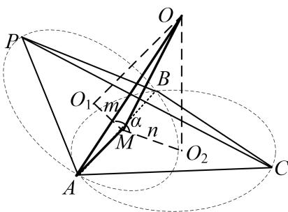
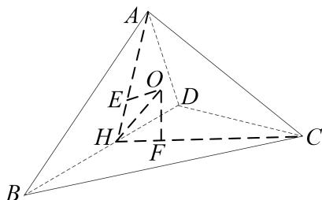
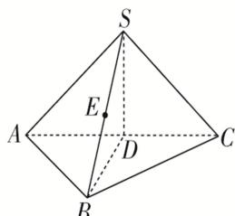

<!-- source-part:1 pages:1-7 -->

## 专题七 鳄鱼模型

【方法总结】

鳄鱼模型即普通三棱锥模型，用找球心法可以解决．如果已知其中两个面的二面角，则可用秒杀公式： $R^{2}=\frac{m^{2}+n^{2}-2mn\cos\alpha}{\sin^{2}\alpha}+\frac{l^{2}}{4}$ （其中 $l=|AB|$ ）解决．

【例题选讲】

[例]
(1)在三棱锥 A-BCD 中， $\Delta ABD$ 和 $\Delta CBD$ 均为边长为 2 的等边三角形，且二面角 A-BD-C 的平面角为 $60^{\circ}$ ，则三棱锥的外接球的表面积为 \_\_\_\_.

答案 $\frac{52\pi}{9}$ 解析 如图，取 $BD$ 中点 $H$ ，连接 $AH$ ， $CH$ ，因为 $\Delta ABD$ 与 $\Delta CBD$ 均为边长为2的等边三角形，所以 $AH \perp BD$ ， $CH \perp BD$ ，则 $\angle AHC$ 为二面角 $A-BD-C$ 的平面角，即 $\angle AHC = 60^\circ$ ，设 $\Delta ABD$ 与 $\Delta CBD$ 外接圆圆心分别为 $E$ ， $F$ ，则由 $AH = 2 \times \frac{\sqrt{3}}{2} = \sqrt{3}$ ，可得 $AE = \frac{2}{3}AH = \frac{2\sqrt{3}}{3}$ ， $EH = \frac{1}{3}AH = \frac{\sqrt{3}}{3}$ 分别过 $EF$ 作平面 $ABD$ ，平面 $BCD$ 的垂线，则三棱锥的外接球一定是两条垂线的交点，记为 $O$ ，连接 $AO$ ， $HO$ ，则由对称性可得 $\angle OHE = 30^\circ$ ，所以 $OE = \tan 30^\circ \cdot HE = \frac{1}{3}$ ，则 $R = OA = \sqrt{AE^2 + OE^2} = \sqrt{\frac{13}{9}}$ ，则三棱锥外接球的表面积 $4\pi R^2 = 4\pi \times \frac{13}{9} = \frac{52\pi}{9}$ ，

(2)在等腰直角 $\Delta ABC$ 中， $AB = 2$ ， $\angle BAC = 90^{\circ}$ ， $AD$ 为斜边 $BC$ 的高，将 $\Delta ABC$ 沿 $AD$ 折叠，使二面角 $B - AD - C$ 为 $60^{\circ}$ ，则三棱锥 $A - BCD$ 的外接球的表面积为

答案 $\frac{14}{3}\pi$ 解析 沿 $AD$ 折叠后二面角 $B - AD - C$ 为 $60^{\circ}$ ，即折叠后 $\angle BDC = 60^{\circ}$ ，所以 $\Delta DBC$ 为等边三角形，又因为 $AB = 2$ ，所以折叠后 $AD = DB = BC = CD = \sqrt{2}$ ，设点 $O$ 为三棱锥 $A - BCD$ 外接球的球心， $O_{1}$ 为 $\Delta BDC$ 的外心，所以 $\frac{\sqrt{2}}{\sin 60^{\circ}} = 2DO_{1}$ ，所以 $DO_{1} = \frac{\sqrt{6}}{3}$ ，又 $OO_{1} = \frac{1}{2} AD = \frac{\sqrt{2}}{2}$ ，所以球心半径 $R^{2} = DO_{1}^{2} + OO_{1}^{2} = (\frac{\sqrt{6}}{3})^{2} + (\frac{\sqrt{2}}{2})^{2} = \frac{7}{6}$ ，所以 $S_{\text{球}} = 4\pi R^{2} = \frac{14}{3}\pi$ 。

(3)在四面体 ABCD 中，AB=AD=2， $\angle BAD=60^{\circ}$ ， $\angle BCD=90^{\circ}$ ，二面角 A-BD-C 的大小为 $150^{\circ}$ ，则四面体 ABCD 外接球的半径为 \_\_\_\_。

答案 $\frac{\sqrt{21}}{3}$ 解析 因为 $\angle BCD = 90^{\circ}$ ，所以 $BC \perp CD$ ，设 $BD$ 的中点为 $O_{2}$ ，则 $O_{2}$ 为 $\triangle BCD$ 外接圆的圆心，由 $AB = AD = 2$ ， $\angle BAD = 60^{\circ}$ 知， $\triangle ABD$ 为等边三角形，设 $\triangle ABD$ 的外接圆的圆心为 $O_{1}$ ，连接 $AO_{2}$ ，则 $O_{1}$ 在线段 $AO_{2}$ 上，过 $O_{1}$ ， $O_{2}$ 分别作平面 $ABD$ 与平面 $BDC$ 的垂线，交于点 $O$ ，则 $O$ 为四面体 $ABCD$ 外接球的球心，过 $O_{2}$ 在平面 $BCD$ 内作 $O_{2}E \perp BD$ ，交 $DC$ 于点 $E$ ，则 $\angle AO_{2}E = 150^{\circ}$ ，所以 $\angle AO_{2}O = 60^{\circ}$ ，又 $O_{1}O_{2} = \frac{\sqrt{3}}{3}$ ，所以 $OO_{1} = 1$ ，连接 $OA$ ，又 $AO_{1} = \frac{2\sqrt{3}}{3}$ ，所以 $OA = \sqrt{AO_{1}^{2} + OO_{1}^{2}} = \sqrt{\left[\frac{2\sqrt{3}}{3}\right]^{2} + 1} = \frac{\sqrt{21}}{3}$ .

(3)在三棱锥 $S - ABC$ 中， $AB \perp BC$ ， $AB = BC = \sqrt{2}$ ， $SA = SC = 2$ ，二面角 $S - AC - B$ 的余弦值是 $-\frac{\sqrt{3}}{3}$ ，若 $S, A, B, C$ 都在同一球面上，则该球的表面积是（）A. $4\pi$ B. $6\pi$ C. $8\pi$ D. $9\pi$

答案 B 解析 如图，取 AC 的中点 D，连接 SD，BD。因为 SA=SC，AB=BC，所以 $SD \perp AC$ ， $BD \perp AC$ ，可得 $\angle SDB$ 即为二面角 S-AC-B 的平面角，故 $\cos\angle SDB=-\frac{\sqrt{3}}{3}$ 。在 $\triangle ABC$ 中， $AB \perp BC$ ， $AB=BC=\sqrt{2}$ ，则 $AC=\sqrt{AB^{2}+BC^{2}}=2$ ，所以 CD=AD=1。在 Rt△SDC 中， $SD=\sqrt{SC^{2}-CD^{2}}=\sqrt{4-1}=\sqrt{3}$ ，同理可得 BD=1，由余弦定理得 $\cos\angle SDB=\frac{3+1-SB^{2}}{2\times\sqrt{3}\times1}=-\frac{\sqrt{3}}{3}$ ，解得 $SB=\sqrt{6}$ 。在 $\triangle SCB$ 中， $SC^{2}+CB^{2}=4+2=(\sqrt{6})^{2}=SB^{2}$ ，所以 $\triangle SCB$ 为直角三角形，同理可得 $\triangle SAB$ 为直角三角形，取 SB 的中点 E，则 $SE=EB=\frac{\sqrt{6}}{2}$ ，在 Rt△SCB 与 Rt△SAB 中， $EA=\frac{SB}{2}=\frac{\sqrt{6}}{2}$ ， $EC=\frac{SB}{2}=\frac{\sqrt{6}}{2}$ ，所以点 E 为该球的球心，半径为 $\frac{\sqrt{6}}{2}$ ，所以该球的表面积为 $S=4\times\pi\times\left(\frac{\sqrt{6}}{2}\right)^{2}=6\pi$ ，故选 B。

(4)已知三棱锥 $P - ABC$ 中， $AB \perp BC$ ， $AB = 2\sqrt{2}$ ， $BC = \sqrt{3}$ ， $PA = PB = 3\sqrt{2}$ ，且二面角 $P - AB - C$ 的大小为 $150^{\circ}$ ，则三棱锥 $P - ABC$ 外接球的表面积为（）A. $100\pi$ B. $108\pi$ C. $110\pi$ D. $111\pi$

答案 D 解析 取 AB 中点 E，AC 中点 F，易知 $AB \perp EF$ ， $AB \perp EP$ ， $\therefore \angle PEF = 150^{\circ}$ ，且平面 $PEF \perp$ 平面 ABC，∴ 作 $PN \perp EF$ 交 FE 的延长线于 N，则 $PN \perp$ 平面 ABC，球心 O 在过 F 与平面 ABC 垂直的直线上如图：作 $OM \perp PN$ 于 M，设 OF = x，由已知条件可得 $FC = \frac{\sqrt{11}}{2}$ ， $EF = \frac{\sqrt{3}}{2}$ ， $EN = PE \cos 30^{\circ} = 2\sqrt{3}$ ， $PN = PE \sin 30^{\circ} = 2$ ，从而 PM = x - 2， $OM = EF + EN = \frac{5\sqrt{3}}{2}$ ，在直角三角形 OMP中， $OP^{2}=(x-2)^{2}+(\frac{5\sqrt{3}}{2})^{2}$ ，在直角三角形 OFC 中， $OC^{2}=x^{2}+(\frac{\sqrt{11}}{2})^{2}$ ，由 $OP^{2}=OC^{2}$ 解得 x=5， $\therefore OC^{2}=\frac{111}{4},\quad\therefore S_{球}=4\pi OC^{2}=111\pi,$

(5)在三棱锥 P-ABC 中， $AB \perp BC$ ，三角形 PAC 为等边三角形，二面角 P-AC-B 的余弦值为 $-\frac{\sqrt{6}}{3}$ ，当三棱锥 P-ABC 的体积最大值为 $\frac{1}{3}$ 时，三棱锥 P-ABC 的外接球的表面积为 \_\_\_\_.

答案 8π 解析 如图所示，过点 P 作 PE⊥面 ABC，垂足为 E，过点 E 作 DE⊥AC 交 AC 于点 D，连接 PD，则 ∠PDE 为二面角 P-AC-B 的平面角的补角，即有 cos∠PDE = $\frac{\sqrt{6}}{3}$ ，易知 AC⊥面 PDE，则 AC⊥PD，而 ΔPAC 为等边三角形，所以 D 为 AC 中点，设 AB = a，BC = b，AC = $\sqrt{a^2 + b^2} = c$ ，则 PE = PD sin∠PDE = $\frac{\sqrt{3}}{2} \times c \times \frac{\sqrt{3}}{3} = \frac{c}{2}$ ，故三棱锥 P-ABC 的体积为： $V = \frac{1}{3} \times \frac{1}{2} ab \times \frac{c}{2} = \frac{1}{12} abc \leqslant \frac{1}{12} c \times \frac{a^2 + b^2}{2} = \frac{c^3}{24}$ ，当且仅当 $a = b = \frac{\sqrt{2}}{2} c$ 时，体积最大，则 $\frac{c^3}{24} = \frac{1}{3}$ ，即 $a = b = \sqrt{2}$ ， $c = 2$ ，所以 B、D、E 三点共线，设三棱锥 P-ABC 的外接球的球心为 O，半径为 R，过点 O 作 OF⊥PE 于 F，则四边形 ODEF 为矩形，则 $OD = EF = \sqrt{R^2 - 1}$ ， $ED = OF = PD \cos\angle PDE = \sqrt{3} \times \frac{\sqrt{6}}{3} = \sqrt{2}$ ， $PE = 1$ ，在 RtΔPFO 中， $R^2 = 2 + (1 - \sqrt{R^2 - 1})^2$ ，解得 $R^2 = 2$ ，三棱锥 P-ABC 的外接球的表面积为 $S = 4\pi R^2 = 8\pi$ 。

(6) 在体积为 $\frac{2\sqrt{3}}{3}$ 的四棱锥 P-ABCD 中，底面 ABCD 为边长为 2 的正方形，ΔPAB 为等边三角形，二面角 P-AB-C 为锐角，则四棱锥 P-ABCD 外接球的半径为（）A. $\frac{\sqrt{21}}{3}$ B. $\sqrt{2}$ C. $\sqrt{3}$ D. $\frac{3}{2}$

答案 A 解析 取 AB 的中点 E，CD 的中点 F，连接 PE，PF，EF，过 P 作 $PH \perp EF$ 于 H，由 AE = BE，CF = DF 可得 $AB \perp EP$ ， $AB \perp EF$ ，所以 $AB \perp$ 面 PEF，可得 $AB \perp PH$ ， $AB \cap EF = E$ ，所以 $PH \perp$ 面 AC，所以 $V_{四棱锥} = \frac{1}{3} S_{底} \times PH = \frac{1}{3} \times 2^{2} \times PH = \frac{2\sqrt{3}}{3}$ ，解得 $PH = \frac{\sqrt{3}}{2}$ ，而 $\Delta PAB$ 为等边三角形，所以 $PE = \frac{\sqrt{3}}{2} \times AB = \sqrt{3}$ ，所以 $\sin \angle PEF = \frac{PH}{PE} = \frac{\frac{\sqrt{3}}{2}}{\sqrt{3}} = \frac{1}{2}$ ，所以可得 $\angle PEF = 30^{\circ}$ ，可得 $EH = \frac{3}{2}$ ， $HF = 2 - EH = \frac{1}{2}$ ， $PF = \sqrt{PH^{2} + HF^{2}} = 1$ ，所以 $PE^{2} + PF^{2} = EF^{2}$ ，所以 $PE \perp PF$ ，取 EF 的中点 N，即四边形 ABCD 的对角线的交点， $AN = \frac{\sqrt{2}}{2} AB = \sqrt{2}$ ，过 N 作 NO 垂直于底面 ABCD，可得 NO // PH，取 O 为外接球的球心，设外接球的半径为 R，连接 OP，OA，则可得 R = OA = OP，过 O 作 OM $\perp PH$ 于 M，则四边形 ONHM 为矩形，所以 OM = NH = NF - HF = $1 - \frac{1}{2} = \frac{1}{2}$ ，ON = MF，(i) 当 O，P 在面 ABCD 的同侧时，在 $\Delta OPM$ 中， $R^{2} = OP^{2} = OM^{2} + PM^{2} = (\frac{1}{2})^{2} + (PH - MH)^{2} = \frac{1}{4} + (\frac{\sqrt{3}}{2} - MH)^{2}$ ①，在 $\Delta AON$ 中，

$R^2 = OA^2 = AN^2 + ON^2 = (\sqrt{2})^2 + MH^2$ ②，由①②可得 $MH < 0$ （舍），(ii)当 $O$ ， $P$ 在面ABCD的两侧时，在 $\Delta OPM$ 中， $R^2 = OP^2 = OM^2 + PM^2 = (\frac{1}{2})^2 + (PH + MH)^2 = \frac{1}{4} + (\frac{\sqrt{3}}{2} + MH)^2$ ③，过在 $\Delta AON$ 中， $R^2 = OA^2 = AN^2 + ON^2 = (\sqrt{2})^2 + MH^2$ ②，由②③可得 $MH = \frac{1}{\sqrt{3}}$ ， $R^2 = 2 + \frac{1}{3} = \frac{7}{3}$ ，所以 $R = \frac{\sqrt{21}}{3}$ ，

## 【对点训练】

![[高中/总复习/专题/几何体的外接球与内切球10大模型/专题7 鳄鱼模型-几何体的外接球与内切球10大模型/专题7_鳄鱼模型/对点训练/Q00040002.md]]
![[高中/总复习/专题/几何体的外接球与内切球10大模型/专题7 鳄鱼模型-几何体的外接球与内切球10大模型/专题7_鳄鱼模型/对点训练/Q00040003.md]]
![[高中/总复习/专题/几何体的外接球与内切球10大模型/专题7 鳄鱼模型-几何体的外接球与内切球10大模型/专题7_鳄鱼模型/对点训练/Q00040004.md]]
![[高中/总复习/专题/几何体的外接球与内切球10大模型/专题7 鳄鱼模型-几何体的外接球与内切球10大模型/专题7_鳄鱼模型/对点训练/Q00040005.md]]
![[高中/总复习/专题/几何体的外接球与内切球10大模型/专题7 鳄鱼模型-几何体的外接球与内切球10大模型/专题7_鳄鱼模型/对点训练/Q00040006.md]]
![[高中/总复习/专题/几何体的外接球与内切球10大模型/专题7 鳄鱼模型-几何体的外接球与内切球10大模型/专题7_鳄鱼模型/对点训练/Q00040007.md]]
![[高中/总复习/专题/几何体的外接球与内切球10大模型/专题7 鳄鱼模型-几何体的外接球与内切球10大模型/专题7_鳄鱼模型/对点训练/Q00040008.md]]
![[高中/总复习/专题/几何体的外接球与内切球10大模型/专题7 鳄鱼模型-几何体的外接球与内切球10大模型/专题7_鳄鱼模型/对点训练/Q00040009.md]]
![[高中/总复习/专题/几何体的外接球与内切球10大模型/专题7 鳄鱼模型-几何体的外接球与内切球10大模型/专题7_鳄鱼模型/对点训练/Q00040010.md]]
![[高中/总复习/专题/几何体的外接球与内切球10大模型/专题7 鳄鱼模型-几何体的外接球与内切球10大模型/专题7_鳄鱼模型/对点训练/Q00040011.md]]
