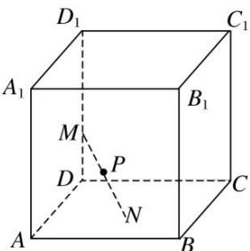

<!-- question-source:start -->
9. 如图, 已知正方体 $ABCD-A_{1}B_{1}C_{1}D_{1}$ 的棱长为 2 , 长为 2 的线段 $MN$ 的一个端点 $M$ 在棱 $DD_{1}$ 上运动, 点 $N$ 在正方体的底面 $ABCD$ 内运动, 则 $MN$ 的中点 $P$ 的轨迹的面积是( )

A. $4\pi$ B. $\pi$ C. $2\pi$ D. $\frac{\pi}{2}$
<!-- question-source:end -->

![[高中/总复习/专题/几何体的外接球与内切球10大模型/专题8 已知球心或球半径模型-几何体的外接球与内切球10大模型/专题8_已知球心或球半径模型/对点训练/answers/Q00040020A1.md]]
