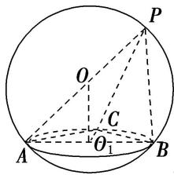

> [!faq]- 《专题8 已知球心或球半径模型-几何体的外接球与内切球10大模型》例题解析
>
> > [!success]- **【答案】** A
>
> > [!note]- **【解析】**
> > 答案 B 解析 取 $AB$ 的中点 $O_{1}$ ，连接 $OO_{1}$ ，如图，在 $\triangle ABC$ 中， $AB = 2\sqrt{2}$ ， $\angle ACB = 90^{\circ}$ ，所以 $\triangle ABC$ 所在小圆 $O_{1}$ 是以 $AB$ 为直径的圆，所以 $O_{1}A = \sqrt{2}$ ，且 $OO_{1} \perp AO_{1}$ ，又球 $O$ 的直径 $PA = 4$ ，所以 $OA =$
> >
> > 2，所以 $OO_{1}=\sqrt{OA^{2}-O_{1}A^{2}}=\sqrt{2}$ ，且 $OO_{1}\perp$ 底面 ABC，所以点 P 到平面 ABC 的距离为 $2OO_{1}=2\sqrt{2}$ .
> >
> > 
