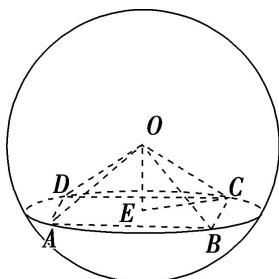

> [!faq]- 《专题8 已知球心或球半径模型-几何体的外接球与内切球10大模型》例题解析
>
> > [!success]- **【答案】** A
>
> > [!note]- **【分析】**
> > 本题未单列分析。
>
> > [!note]- **【解析】**
> > 答案 A. 解析 如图，设矩形 $ABCD$ 的中心为 $E$ ，连接 $OE, EC$ ，由球的性质可得 $OE \perp$ 平面 $ABCD$ ，所以 $V_{O-ABCD} = \frac{1}{3} \cdot OE \cdot S_{\text{矩形 }ABCD} = \frac{1}{3} \times OE \times 6 \times 2\sqrt{3} = 8\sqrt{3}$ ，所以 $OE = 2$ ，在矩形 $ABCD$ 中可得 $EC = 2\sqrt{3}$ ，则 $R = \sqrt{OE^2 + EC^2} = \sqrt{4 + 12} = 4$ ，故选 A.
> > 
