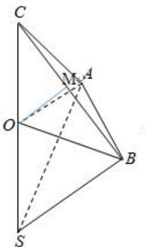

> [!faq]- 《专题8 已知球心或球半径模型-几何体的外接球与内切球10大模型》例题解析
>
> > [!success]- **【答案】** 详见解析
>
> > [!note]- **【分析】**
> > 本题未单列分析。
>
> > [!note]- **【解析】**
> > 答案 $16\pi$ 解析 由题意，设球的直径 $SC = 2R, A, B$ 是该球面上的两点，如图所示，因为 $AB = AC = \sqrt{2}, BC = 2$ ，所以 $\Delta ABC$ 为直角三角形，设三棱锥 $S - ABC$ 的高为 $h$ ，则 $\frac{1}{3} \times \frac{1}{2} \times \sqrt{2} \times \sqrt{2} h = \frac{2\sqrt{3}}{3}$ ，解得 $h = 2\sqrt{3}$ ，取 $BC$ 的中点 $M$ ，连接 $OM$ ，根据球的性质，可得 $OM \perp$ 平面 $ABC$ ，所以 $OM = \sqrt{3}$ ，在直角 $\Delta OMC$ 中， $OC = \sqrt{OM^2 + MC^2} = \sqrt{(\sqrt{3})^2 + 1^2} = 2$ ，即球的半径为 $R = 2$ ，所以球的表面积为
> > $$
> > S = 4 \pi R ^ {2} = 4 \pi \times 2 ^ {2} = 1 6 \pi .
> > $$
> > 
