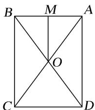

> [!faq]- 《专题8 已知球心或球半径模型-几何体的外接球与内切球10大模型》例题解析
>
> > [!success]- **【答案】** 详见解析
>
> > [!note]- **【解析】**
> > 答案 $\frac{3\pi}{4}$ 解析 如图画出圆柱的轴截面 $ABCD, O$ 为球心. 球半径 $R = OA = 1$ ，球心到底面圆的距离为 $OM = \frac{1}{2}$ . $\therefore$ 底面圆半径 $r = \sqrt{OA^2 - OM^2} = \frac{\sqrt{3}}{2}$ ，故圆柱体积 $V = \pi \cdot r^2 \cdot h = \pi \cdot \left(\frac{\sqrt{3}}{2}\right)^2 \times 1 = \frac{3\pi}{4}$ .
> >
> > 
