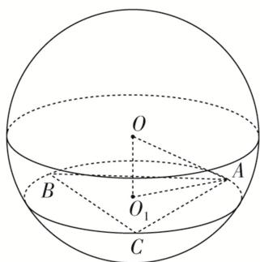

> [!faq]- 《专题8 已知球心或球半径模型-几何体的外接球与内切球10大模型》例题解析
>
> > [!success]- **【答案】** A
>
> > [!note]- **【分析】**
> > 本题未单列分析。
>
> > [!note]- **【解析】**
> > 答案 A 解析 设 $\odot O_{1}$ 的半径为 $r$ , 球的半径为 $R$ , 依题意, 得 $\pi r^{2} = 4\pi$ , $\therefore r = 2$ . 由正弦定理可得 $\frac{AB}{\sin 60^{\circ}} = 2r$ , $\therefore AB = 2r \sin 60^{\circ} = 2\sqrt{3}$ . $\therefore OO_{1} = AB = 2\sqrt{3}$ . 根据球的截面性质, 得 $OO_{1} \perp$ 平面 $ABC$ , $\therefore OO_{1} \perp O_{1}A$ , $R = OA = \sqrt{OO_{1}^{2} + O_{1}A^{2}} = \sqrt{OO_{1}^{2} + r^{2}} = 4$ , $\therefore$ 球 $O$ 的表面积 $S = 4\pi R^{2} = 64\pi$ . 故选 A.
> > 
