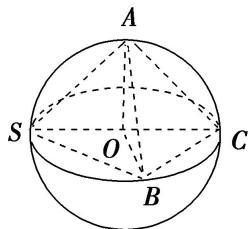
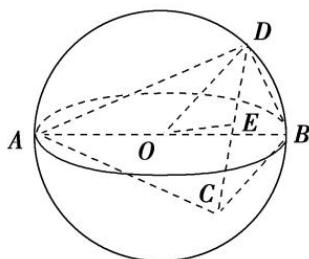
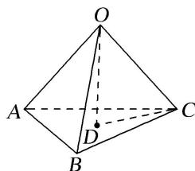
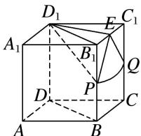
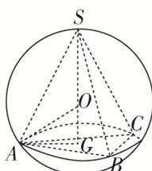

<!-- source-part:1 pages:1-6 -->

## 专题八 已知球心或球半径模型

## 【例题选讲】

[例] (1)(2017·全国 I)已知三棱锥 S-ABC 的所有顶点都在球 O 的球面上，SC 是球 O 的直径．若平面 SCA⊥平面 SCB，SA=AC，SB=BC，三棱锥 S-ABC 的体积为 9，则球 O 的表面积为 \_\_\_\_．

答案 $36\pi$ 解析 如图，连接 AO, OB, $\because SC$ 为球 O 的直径，∴ 点 O 为 SC 的中点， $\because SA = AC, SB = BC,$

∴ $AO \perp SC$ , $BO \perp SC$ , ∵ 平面 SCA ⊥ 平面 SCB, 平面 SCA ∩ 平面 SCB = SC, ∴ $AO \perp$ 平面 SCB, 设球 O 的半径为 R, 则 OA = OB = R, SC = 2R. ∴ $V_{S-ABC} = V_{A-SBC} = \frac{1}{3} \times S_{\triangle SBC} \times AO = \frac{1}{3} \times \left(\frac{1}{2} \times SC \times OB\right) \times AO$ , 即 $9 = \frac{1}{3} \times \left(\frac{1}{2} \times 2R \times R\right) \times R$ , 解得 R = 3, ∴ 球 O 的表面积为 $S = 4\pi R^{2} = 4\pi \times 3^{2} = 36\pi$ .

(2)已知三棱锥 A-BCD 的所有顶点都在球 O 的球面上，AB 为球 O 的直径，若该三棱锥的体积为 $\sqrt{3}$ ，BC=3， $BD=\sqrt{3}$ ， $\angle CBD=90^{\circ}$ ，则球 O 的体积为 \_\_\_\_.

答案 $\frac{32\pi}{3}$ 解析 设 $A$ 到平面 $BCD$ 的距离为 $h$ , $\because$ 三棱锥的体积为 $\sqrt{3}$ , $BC = 3$ , $BD = \sqrt{3}$ , $\angle CBD = 90^\circ$ , $\therefore \frac{1}{3} \times \frac{1}{2} \times 3 \times \sqrt{3} \times h = \sqrt{3}$ , $\therefore h = 2$ , $\therefore$ 球心 $O$ 到平面 $BCD$ 的距离为 1. 设 $CD$ 的中点为 $E$ , 连接 $OE$ , 则由球的截面性质可得 $OE \perp$ 平面 $CBD$ , $\because \triangle BCD$ 外接圆的直径 $CD = 2\sqrt{3}$ , $\therefore$ 球 $O$ 的半径 $OD = 2$ , $\therefore$ 球 $O$ 的体积为 $\frac{32\pi}{3}$ .

(3)(2012 全国 I)已知三棱锥 S-ABC 的所有顶点都在球 O 的球面上， $\triangle ABC$ 是边长为 1 的正三角形，SC 为球 O 的直径，且 SC=2，则此棱锥的体积为( )

A. $\frac{\sqrt{2}}{6}$ B. $\frac{\sqrt{3}}{6}$ C. $\frac{\sqrt{2}}{3}$ D. $\frac{\sqrt{2}}{2}$

答案 A 解析 由于三棱锥 S-ABC 与三棱锥 O-ABC 底面都是 $\triangle ABC$ ，O 是 SC 的中点，因此三棱锥 S-ABC 的高是三棱锥 O-ABC 高的 2 倍，所以三棱锥 S-ABC 的体积也是三棱锥 O-ABC 体积的 2 倍。在三棱锥 O-ABC 中，其棱长都是 1，如图所示， $S_{\triangle ABC} = \frac{\sqrt{3}}{4} \times AB^{2} = \frac{\sqrt{3}}{4}$ ，高 $OD = \sqrt{1^{2} - \left(\frac{\sqrt{3}}{3}\right)^{2}} = \frac{\sqrt{6}}{3}$ ， $\therefore V_{S-ABC} = 2V_{O-ABC} = 2 \times \frac{1}{3} \times \frac{\sqrt{3}}{4} \times \frac{\sqrt{6}}{3} = \frac{\sqrt{2}}{6}$ 。故选 A.

(4)(2020·新高考全国I)已知直四棱柱 $ABCD - A_{1}B_{1}C_{1}D_{1}$ 的棱长均为 2， $\angle BAD = 60^{\circ}$ 。以 $D_{1}$ 为球心， $\sqrt{5}$ 为半径的球面与侧面 $BCC_{1}B_{1}$ 的交线长为 \_\_\_\_.

答案 $\frac{\sqrt{2}\pi}{2}$ 解析 如图，设 $B_{1}C_{1}$ 的中点为 E，

球面与棱 $BB_{1}$ , $CC_{1}$ 的交点分别为 $P$ , $Q$ , 连接 $DB$ , $D_{1}B_{1}$ , $D_{1}P$ , $D_{1}E$ , $EP$ , $EQ$ , 由 $\angle BAD = 60^{\circ}$ , $AB = AD$ , 知 $\triangle ABD$ 为等边三角形, $\therefore D_{1}B_{1} = DB = 2$ , $\therefore \triangle D_{1}B_{1}C_{1}$ 为等边三角形, 则 $D_{1}E = \sqrt{3}$ 且 $D_{1}E \perp$ 平面 $BCC_{1}B_{1}$ , $\therefore E$ 为球面截侧面 $BCC_{1}B_{1}$ 所得截面圆的圆心, 设截面圆的半径为 $r$ , 则 $r = \sqrt{R_{\text{球}}^{2} - D_{1}E^{2}} = \sqrt{5 - 3} = \sqrt{2}$ . 又由题意可得 $EP = EQ = \sqrt{2}$ , $\therefore$ 球面与侧面 $BCC_{1}B_{1}$ 的交线为以 $E$ 为圆心的圆弧 $PQ$ . 又 $D_{1}P = \sqrt{5}$ , $\therefore B_{1}P = \sqrt{D_{1}P^{2} - D_{1}B_{1}^{2}} = 1$ , 同理 $C_{1}Q = 1$ , $\therefore P, Q$ 分别为 $BB_{1}$ , $CC_{1}$ 的中点, $\therefore \angle PEQ = \frac{\pi}{2}$ , 知 $\widehat{PQ}$ 的长为 $\frac{\pi}{2} \times \sqrt{2} = \frac{\sqrt{2}\pi}{2}$ , 即交线长为 $\frac{\sqrt{2}\pi}{2}$ .

(5)三棱锥 S-ABC 的底面各棱长均为 3，其外接球半径为 2，则三棱锥 S-ABC 的体积最大时，点 S 到平面 ABC 的距离为( )

A. $2+\sqrt{3}$ B. $2-\sqrt{3}$ C. 3

D. 2

答案 C 解析 如图，设三棱锥 S-ABC 底面三角形 ABC 的外心为 G，三棱锥外接球的球心为 O，要使三棱锥 S-ABC 的体积最大，则 O 在 SG 上，由底面三角形的边长为 3，可得 $AG=\frac{3}{2\sin60^{\circ}}=\sqrt{3}$ 。连接 OA，在 Rt△OGA 中，由勾股定理求得 $OG=\sqrt{OA^{2}-GA^{2}}=\sqrt{2^{2}-(\sqrt{3})^{2}}=1$ 。∴ 点 S 到平面 ABC 的距离为 $OS+OG=2+1=3$ 。故选 C。

【对点训练】

![[高中/总复习/专题/几何体的外接球与内切球10大模型/专题8 已知球心或球半径模型-几何体的外接球与内切球10大模型/专题8_已知球心或球半径模型_几何体的外接球与内切球10大模型/对点训练/Q00040012.md]]
![[高中/总复习/专题/几何体的外接球与内切球10大模型/专题8 已知球心或球半径模型-几何体的外接球与内切球10大模型/专题8_已知球心或球半径模型_几何体的外接球与内切球10大模型/对点训练/Q00040013.md]]
![[高中/总复习/专题/几何体的外接球与内切球10大模型/专题8 已知球心或球半径模型-几何体的外接球与内切球10大模型/专题8_已知球心或球半径模型_几何体的外接球与内切球10大模型/对点训练/Q00040014.md]]
![[高中/总复习/专题/几何体的外接球与内切球10大模型/专题8 已知球心或球半径模型-几何体的外接球与内切球10大模型/专题8_已知球心或球半径模型_几何体的外接球与内切球10大模型/对点训练/Q00040015.md]]
![[高中/总复习/专题/几何体的外接球与内切球10大模型/专题8 已知球心或球半径模型-几何体的外接球与内切球10大模型/专题8_已知球心或球半径模型_几何体的外接球与内切球10大模型/对点训练/Q00040016.md]]
![[高中/总复习/专题/几何体的外接球与内切球10大模型/专题8 已知球心或球半径模型-几何体的外接球与内切球10大模型/专题8_已知球心或球半径模型_几何体的外接球与内切球10大模型/对点训练/Q00040017.md]]
![[高中/总复习/专题/几何体的外接球与内切球10大模型/专题8 已知球心或球半径模型-几何体的外接球与内切球10大模型/专题8_已知球心或球半径模型_几何体的外接球与内切球10大模型/对点训练/Q00040018.md]]
![[高中/总复习/专题/几何体的外接球与内切球10大模型/专题8 已知球心或球半径模型-几何体的外接球与内切球10大模型/专题8_已知球心或球半径模型_几何体的外接球与内切球10大模型/对点训练/Q00040019.md]]
![[高中/总复习/专题/几何体的外接球与内切球10大模型/专题8 已知球心或球半径模型-几何体的外接球与内切球10大模型/专题8_已知球心或球半径模型_几何体的外接球与内切球10大模型/对点训练/Q00040020.md]]
![[高中/总复习/专题/几何体的外接球与内切球10大模型/专题8 已知球心或球半径模型-几何体的外接球与内切球10大模型/专题8_已知球心或球半径模型_几何体的外接球与内切球10大模型/对点训练/Q00040021.md]]
