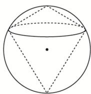

<!-- question-source:start -->
8. 如图, 半径为 $R$ 的球的两个内接圆锥有公共的底面, 若两个圆锥的体积之和为球的体积的 $\frac{3}{8}$ , 则这两个圆锥高之差的绝对值为 ( )

A. $\frac{R}{2}$ B. $\frac{2R}{3}$ C. $\frac{4R}{3}$ D. $R$
<!-- question-source:end -->

![[高中/总复习/专题/几何体的外接球与内切球10大模型/专题8 已知球心或球半径模型-几何体的外接球与内切球10大模型/专题8_已知球心或球半径模型_几何体的外接球与内切球10大模型/对点训练/answers/Q00040019A1.md]]
