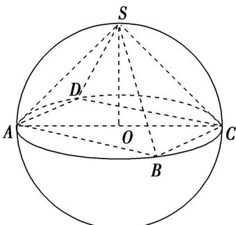
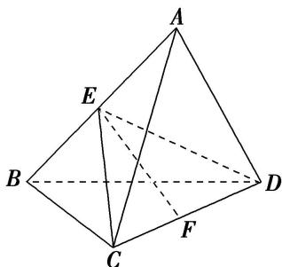

<!-- source-part:1 pages:1-7 -->

# 专题九 最值模型

## 【方法总结】

最值问题的解法有两种方法：一种是几何法，即在运动变化过程中得到最值，从而转化为定值问题求解．另一种是代数方法，即建立目标函数，从而求目标函数的最值．

【例题选讲】

[例]
(1)已知三棱锥 $P - ABC$ 的顶点 $P, A, B, C$ 在球 $O$ 的球面上， $\triangle ABC$ 是边长为 $\sqrt{3}$ 的等边三角形，如果球 $O$ 的表面积为 $36\pi$ ，那么 $P$ 到平面 $ABC$ 距离的最大值为 \_\_\_\_.

答案 $3 + 2\sqrt{2}$ 解析 依题意，边长是 $\sqrt{3}$ 的等边 $\triangle ABC$ 的外接圆半径 $r = \frac{1}{2} \cdot \frac{\sqrt{3}}{\sin 60^\circ} = 1$ . ∵ 球 $O$ 的表面积为 $36\pi = 4\pi R^2$ ，∴ 球 $O$ 的半径 $R = 3$ ，∴ 球心 $O$ 到平面 $ABC$ 的距离 $d = \sqrt{R^2 - r^2} = 2\sqrt{2}$ ，∴ 球面上的点 $P$ 到平面 $ABC$ 距离的最大值为 $R + d = 3 + 2\sqrt{2}$ .

(2)在四面体 ABCD 中，AB=1， $BC=CD=\sqrt{3}$ ， $AC=\sqrt{2}$ ，当四面体 ABCD 的体积最大时，其外接球的表面积为( )

A. $2\pi$ B. $3\pi$ C. $6\pi$ D. $8\pi$

答案 C 解析 $\because AB = 1, BC = \sqrt{3}, AC = \sqrt{2}$ ，由勾股定理可得 $AB^2 + AC^2 = BC^2$ ，所以 $\triangle ABC$ 是以 $BC$ 为斜边的直角三角形，且该三角形的外接圆直径为 $BC = \sqrt{3}$ ，当 $CD \perp$ 平面 $ABC$ 时，四面体 $ABCD$ 的体积取最大值，此时，其外接球的直径为 $2R = \sqrt{BC^2 + CD^2} = \sqrt{6}$ ，因此，四面体 $ABCD$ 的外接球的表面积为 $4\pi R^2 = \pi \times (2R)^2 = 6\pi$ 。故选 C.

(3)已知四棱锥 S-ABCD 的所有顶点在同一球面上，底面 ABCD 是正方形且球心 O 在此平面内，当四棱锥的体积取得最大值时，其表面积等于 $16+16\sqrt{3}$ ，则球 O 的体积等于( )

A. $\frac{4\sqrt{2}\pi}{3}$ B. $\frac{16\sqrt{2}\pi}{3}$ C. $\frac{32\sqrt{2}\pi}{3}$ D. $\frac{64\sqrt{2}\pi}{3}$

答案 D 解析 由题意得，当四棱锥的体积取得最大值时，该四棱锥为正四棱锥。因为该四棱锥的表面积等于 $16 + 16\sqrt{3}$ ，设球 $O$ 的半径为 $R$ ，则 $AC = 2R, SO = R$ ，如图，所以该四棱锥的底面边长 $AB = \sqrt{2} R$ ，则有 $(\sqrt{2} R)^2 + 4 \times \frac{1}{2} \times \sqrt{2} R \times \sqrt{(\sqrt{2} R)^2 - \left(\frac{\sqrt{2}}{2} R\right)^2} = 16 + 16\sqrt{3}$ ，解得 $R = 2\sqrt{2}$ ，所以球 $O$ 的体积是 $\frac{4}{3}\pi R^3 = \frac{64\sqrt{2}}{3}\pi$ 。故选 D.

(4)三棱锥 A-BCD 内接于半径为 $\sqrt{5}$ 的球 O 中，AB=CD=4，则三棱锥 A-BCD 的体积的最大值为 ( )
A. $\frac{4}{3}$ B. $\frac{8}{3}$ C. $\frac{16}{3}$ D. $\frac{32}{3}$

答案 C 解析 如图，过 CD 作平面 ECD，使 $AB \perp$ 平面 ECD，交 AB 于点 E，设点 E 到 CD 的距离为 EF，当球心在 EF 上时，EF 最大，此时 E，F 分别为 AB，CD 的中点，且球心 O 为 EF 的中点，所以

$EF=2$ ，所以 $V_{\max}=\frac{1}{3}\times\frac{1}{2}\times4\times2\times4=\frac{16}{3}$ ，故选 C.

(5)已知正四棱柱的顶点在同一个球面上，且球的表面积为 $12\pi$ ，当正四棱柱的体积最大时，正四棱柱的高为\_\_\_\_。

答案 8 解析 设正四棱柱的底面边长为 a，高为 h，球的半径为 r，由题意知 $4\pi r^{2}=12\pi$ ，所以 $r^{2}=3$ ，又 $2a^{2}+h^{2}=(2r)^{2}=12$ ，所以 $a^{2}=6-\frac{h^{2}}{2}$ ，所以正四棱柱的体积 $V=a^{2}h=\left(6-\frac{h^{2}}{2}\right)h$ ，则 $V'=6-\frac{3}{2}h^{2}$ ，由 $V'>0$ ，得 0<h<2，由 $V'<0$ ，得 h>2，所以当 h=2 时，正四棱柱的体积最大， $V_{max}=8$ 。

## 【对点训练】

![[高中/总复习/专题/几何体的外接球与内切球10大模型/专题9 最值模型-几何体的外接球与内切球10大模型/专题9_最值模型/对点训练/Q00040022.md]]
![[高中/总复习/专题/几何体的外接球与内切球10大模型/专题9 最值模型-几何体的外接球与内切球10大模型/专题9_最值模型/对点训练/Q00040023.md]]
![[高中/总复习/专题/几何体的外接球与内切球10大模型/专题9 最值模型-几何体的外接球与内切球10大模型/专题9_最值模型/对点训练/Q00040024.md]]
![[高中/总复习/专题/几何体的外接球与内切球10大模型/专题9 最值模型-几何体的外接球与内切球10大模型/专题9_最值模型/对点训练/Q00040025.md]]
![[高中/总复习/专题/几何体的外接球与内切球10大模型/专题9 最值模型-几何体的外接球与内切球10大模型/专题9_最值模型/对点训练/Q00040026.md]]
![[高中/总复习/专题/几何体的外接球与内切球10大模型/专题9 最值模型-几何体的外接球与内切球10大模型/专题9_最值模型/对点训练/Q00040027.md]]
![[高中/总复习/专题/几何体的外接球与内切球10大模型/专题9 最值模型-几何体的外接球与内切球10大模型/专题9_最值模型/对点训练/Q00040028.md]]
![[高中/总复习/专题/几何体的外接球与内切球10大模型/专题9 最值模型-几何体的外接球与内切球10大模型/专题9_最值模型/对点训练/Q00040029.md]]
![[高中/总复习/专题/几何体的外接球与内切球10大模型/专题9 最值模型-几何体的外接球与内切球10大模型/专题9_最值模型/对点训练/Q00040030.md]]
![[高中/总复习/专题/几何体的外接球与内切球10大模型/专题9 最值模型-几何体的外接球与内切球10大模型/专题9_最值模型/对点训练/Q00040031.md]]
![[高中/总复习/专题/几何体的外接球与内切球10大模型/专题9 最值模型-几何体的外接球与内切球10大模型/专题9_最值模型/对点训练/Q00040032.md]]
![[高中/总复习/专题/几何体的外接球与内切球10大模型/专题9 最值模型-几何体的外接球与内切球10大模型/专题9_最值模型/对点训练/Q00040033.md]]
![[高中/总复习/专题/几何体的外接球与内切球10大模型/专题9 最值模型-几何体的外接球与内切球10大模型/专题9_最值模型/对点训练/Q00040034.md]]
![[高中/总复习/专题/几何体的外接球与内切球10大模型/专题9 最值模型-几何体的外接球与内切球10大模型/专题9_最值模型/对点训练/Q00040035.md]]
