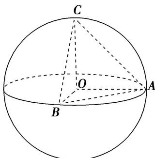

> [!faq]- 《专题9 最值模型-几何体的外接球与内切球10大模型》例题解析
>
> > [!success]- **【答案】** A
>
> > [!note]- **【分析】**
> > 本题未单列分析。
>
> > [!note]- **【解析】**
> > 答案 C 解析 $\because S_{\triangle OAB}$ 是定值，且 $V_{O - ABC} = V_{C - OAB}$ ， $\therefore$ 当 $OC \perp$ 平面 $OAB$ 时， $V_{C - OAB}$ 最大，即 $V_{O - ABC}$ 最大。设球 $O$ 的半径为 $R$ ，则 $(V_{O - ABC})_{\max} = \frac{1}{3} \times \frac{1}{2} R^2 \times R = \frac{1}{6} R^3 = 36, \therefore R = 6, \therefore$ 球 $O$ 的表面积 $S = 4\pi R^2 = 4\pi \times 6^2 = 144\pi$ .
> >
> > 
