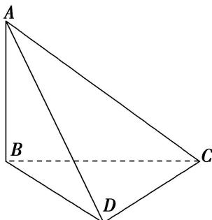

> [!faq]- 《专题9 最值模型-几何体的外接球与内切球10大模型》例题解析
>
> > [!success]- **【答案】** 详见解析
>
> > [!note]- **【分析】**
> > 本题未单列分析。
>
> > [!note]- **【解析】**
> > 答案 $6\pi$ 解析 $\because AB = 1, BC = \sqrt{2}, AC = \sqrt{3}, \therefore AB^2 + BC^2 = AC^2$ ，即 $\triangle ABC$ 为直角三角形，当 $CD$ 上面 $ABC$ 时，三棱锥 $A - BCD$ 的体积最大，又 $\because CD = \sqrt{3}, \triangle ABC$ 外接圆的半径为 $\frac{\sqrt{3}}{2}$ ，故外接球的半径 $R$ 满足 $R^2 = \left(\frac{\sqrt{3}}{2}\right)^2 + \left(\frac{\sqrt{3}}{2}\right)^2 = \frac{3}{2}$ ， $\therefore$ 外接球的表面积为 $4\pi R^2 = 6\pi$ .
> >
> > 
