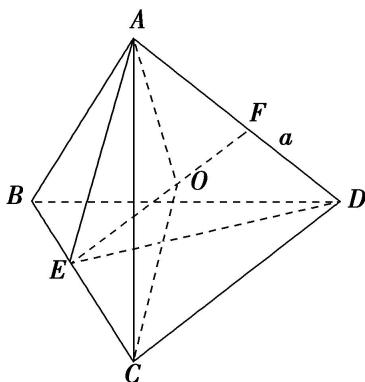

> [!faq]- 《专题9 最值模型-几何体的外接球与内切球10大模型》例题解析
>
> > [!success]- **【答案】** B
>
> > [!note]- **【分析】**
> > 本题未单列分析。
>
> > [!note]- **【解析】**
> > 答案 B 解析 由题意画出三棱锥的图形,
> > 
> > 其中 $AB = BC = CD = BD = AC = 2$ ， $AD = a$ ，取 $BC$ ， $AD$ 的中点分别为 $E$ ， $F$ ，可知 $AE \perp BC$ ， $DE \perp BC$ 且 $AE \cap DE = E$ ， $\therefore BC \perp$ 平面 $AED$ ， $\therefore$ 平面 $ABC \perp$ 平面 $BCD$ 时，三棱锥 $A - BCD$ 的体积最大，此时 $AD = a = \sqrt{2} AE = \sqrt{2} \times \sqrt{3} = \sqrt{6}$ 。设三棱锥外接球的球心为 $O$ ，半径为 $R$ ，由球体的对称性知，球心 $O$ 在线段 $EF$ 上， $\therefore OA = OC = R$ ，又 $EF = \sqrt{AE^2 - AF^2} = \sqrt{(\sqrt{3})^2 - \left(\frac{\sqrt{6}}{2}\right)^2} = \frac{\sqrt{6}}{2}$ ，设 $OF = x, OE = \frac{\sqrt{6}}{2} - x, \therefore R^2 = \left(\frac{\sqrt{6}}{2}\right)^2 + x^2 = \left(\frac{\sqrt{6}}{2} - x\right)^2 + 1$ ，解得 $x = \frac{\sqrt{6}}{6}$ 。 $\therefore$ 球的半径 $R$ 满足 $R^2 = \frac{5}{3}$ ， $\therefore$ 三棱锥外接球的表面积为 $4\pi R^2 = 4\pi \times \frac{5}{3} = \frac{20\pi}{3}$ ，
> >
> > 故选 **B**.
