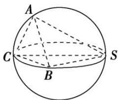

> [!faq]- 《专题9 最值模型-几何体的外接球与内切球10大模型》例题解析
>
> > [!success]- **【答案】** A
>
> > [!note]- **【分析】**
> > 本题未单列分析。
>
> > [!note]- **【解析】**
> > 答案 A 解析 如图，因为球的直径为 SC，且 SC=4， $\angle ASC=\angle BSC=30^{\circ}$ ，所以 $\angle SAC=\angle SBC=90^{\circ}$ ，AC=BC=2，SA=SB= $2\sqrt{3}$ ，所以 $S_{\triangle SBC}=\frac{1}{2}\times2\times2\sqrt{3}=2\sqrt{3}$ ，则当点 A 到平面 SBC 的距离最大时，棱锥 A-SBC 即 S-ABC 的体积最大，此时平面 $SAC \perp$ 平面 SBC，点 A 到平面 SBC 的距离为 $2\sqrt{3}\sin30^{\circ}=\sqrt{3}$ ，所以棱锥 S-ABC 的体积最大为 $\frac{1}{3}\times2\sqrt{3}\times\sqrt{3}=2$ ，故选 A.
> >
> > 
