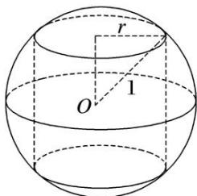

> [!faq]- 《专题9 最值模型-几何体的外接球与内切球10大模型》例题解析
>
> > [!success]- **【答案】** 详见解析
>
> > [!note]- **【分析】**
> > 本题未单列分析。
>
> > [!note]- **【解析】**
> > 答案 $\frac{4\sqrt{2}}{3}$ 解析 如图所示，设圆柱的底面半径为 $r$ ，则圆柱的侧面积为
> > 
> > $S=2\pi r\times2\sqrt{1-r^{2}}=4\pi r\sqrt{1-r^{2}}\leq4\pi\times\frac{r^{2}+(1-r^{2})}{2}=2\pi\left(\text{当且仅当 }r^{2}=1-r^{2}, \text{ 即 }r=\frac{\sqrt{2}}{2}\text{ 时取等号}\right), \text{ 所以当 }r=\frac{\sqrt{2}}{2}\text{ 时, }\frac{V_{\text{球}}}{V_{\text{圆柱}}}=\frac{\frac{4\pi}{3}\times1^{3}}{\pi\left(\frac{\sqrt{2}}{2}\right)_{2}\times\sqrt{2}}=\frac{4\sqrt{2}}{3}.$
