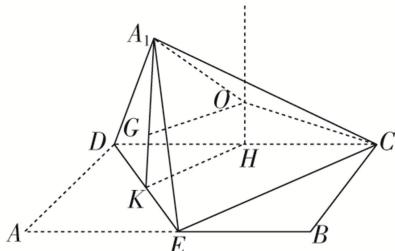

> [!faq]- 《专题9 最值模型-几何体的外接球与内切球10大模型》例题解析
>
> > [!success]- **【答案】** B
>
> > [!note]- **【分析】**
> > 本题未单列分析。
>
> > [!note]- **【解析】**
> > 答案 B 解析 在矩形 $ABCD$ 中, 已知 $AB = 2AD = 2a$ , $E$ 是 $AB$ 的中点, 所以 $\triangle A_{1}DE$ 为等腰直角三
> > 角形，斜边 $DE$ 上的高为 $A_{1}K = \frac{1}{2} DE = \frac{1}{2}\sqrt{a^{2} + a^{2}} = \frac{\sqrt{2}}{2} a$ 。要想三棱锥 $A_{1}-CDE$ 的体积最大，需高最大，则当 $\triangle A_{1}DE \perp$ 面 $BCDE$ 时体积最大，此时三棱锥 $A_{1}-CDE$ 的高等于 $A_{1}K = \frac{\sqrt{2}}{2} a$ ，取 $DC$ 的中点 $H$ ，过 $H$ 作下底面的垂线，此时三棱锥 $A_{1}-CDE$ 的外接球球心 $O$ 在此垂线上。因为三棱锥 $A_{1}-CDE$ 外接球的体积为 $\frac{8\sqrt{2}\pi}{3}$ ，所以球半径 $R = \sqrt{2}$ ，如图， $OH^{2} = OC^{2} - CH^{2}$ ，①， $A_{1}O^{2} = A_{1}G^{2} + GO^{2}$ ，②，即 $OH^{2} = R^{2} - a^{2}$ ，③， $R^{2} = \left(\frac{\sqrt{2}}{2} a - OH\right)^{2} + \left(\frac{\sqrt{2}}{2} a\right)^{2}$ ，④，联立③④可得 $a = \sqrt{2}$ 。故选 B.
> > 
