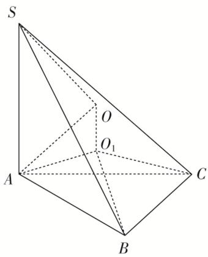

> [!faq]- 《专题9 最值模型-几何体的外接球与内切球10大模型》例题解析
>
> > [!success]- **【答案】** 详见解析
>
> > [!note]- **【分析】**
> > 本题未单列分析。
>
> > [!note]- **【解析】**
> > 答案 $\frac{40\sqrt{10}\pi}{3}$ 解析 $V_{S - ABC} = \frac{1}{3} S_{\triangle ABC} \cdot SA = \frac{1}{3} \times \frac{1}{2} \times \frac{\sqrt{3}}{2} BA \cdot BC \times 4 = 2\sqrt{3}$ ，故 $BA \cdot BC = 6$ 。根据余弦定理 $AC^2 = BA^2 + BC^2 - 2BA \cdot BC \cos B = BA^2 + BC^2 + BA \cdot BC \geq 3BA \cdot BC$ ，即 $AC \geq 3\sqrt{2}$ ，当 $BA = BC$ 时等号成立。设 $\triangle ABC$ 的外接圆半径为 $r$ ，故 $2r = \frac{b}{\sin B} \geq 2\sqrt{6}$ ，即 $r \geq \sqrt{6}$ 。设球 $O$ 的半径为 $R$ ，球心 $O$ 在平面 $ABC$ 的投影 $O_1$ 为 $\triangle ABC$ 外心，则 $R^2 = r^2 + \left(\frac{SA}{2}\right)^2 \geq 6 + 4 = 10, R \geq \sqrt{10}, V = \frac{4}{3}\pi R^3 \geq \frac{40\sqrt{10}\pi}{3}$ 。
> >
> > 
