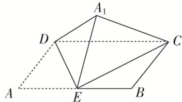

<!-- question-source:start -->
13. 如图，在矩形 ABCD 中，已知 AB=2AD=2a，E 是 AB 的中点，将 $\triangle ADE$ 沿直线 DE 翻折成 $\triangle A_{1}DE$ ，

连接 $A_{1}C$ 。若当三棱锥 $A_{1}-CDE$ 的体积取得最大值时，三棱锥 $A_{1}-CDE$ 外接球的体积为 $\frac{8\sqrt{2}\pi}{3}$ ，则 $a=(\quad)$

A. 2 B. $\sqrt{2}$ C. $2\sqrt{2}$ D. 4
<!-- question-source:end -->

![[高中/总复习/专题/几何体的外接球与内切球10大模型/专题9 最值模型-几何体的外接球与内切球10大模型/专题9_最值模型_几何体的外接球与内切球10大模型/对点训练/answers/Q00040034A1.md]]
