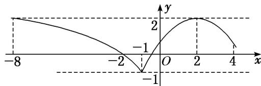
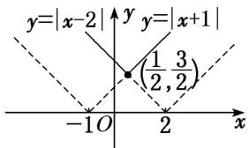

<!-- question-source:start -->
(2) = 2$ ，又 $f
(4) = \frac{2}{3} < 2$ ， $f(-1) = -1$ ，故所求实数 $m$ 的取值范围为 $[-8, -1]$ .

(4) 对 $a, b \in \mathbf{R}$ , 记 $\max\{a, b\} = \begin{cases} a, & a \geq b, \\ b, & a < b, \end{cases}$ 函数 $f(x) = \max\{|x + 1|, |x - 2|\}(x \in \mathbf{R})$ 的最小值是 \_\_\_\_. 答案 $\frac{3}{2}$ 解析 函数 $f(x) = \max\{|x + 1|, |x - 2|\}(x \in \mathbf{R})$ 的图象如图所示，由图象可得，其最小值为 $\frac{3}{2}$ .

(5) 设函数 $f(x)$ 是定义在 $\mathbf{R}$ 上的偶函数，且对任意的 $x \in \mathbb{R}$ 恒有 $f(x + 1) = f(x - 1)$ ，已知当 $x \in [0, 1]$ 时， $f(x) = \left(\frac{1}{2}\right)^{1 - x}$ ，则说法：①2 是函数 $f(x)$ 的周期；②函数 $f(x)$ 在 (1, 2) 上递减，在 (2, 3) 上递增；③函数 $f(x)$ 的最大值是 1，最小值是 0；④当 $x \in (3, 4)$ 时， $f(x) = \left(\frac{1}{2}\right)^{x - 3}$ .

其中所有正确说法的序号是\_\_\_\_。
<!-- question-source:end -->

![[高中/总复习/专题/函数/专题10 函数图象的应用-函数/考点01_利用函数图象研究函数的性质/例题/answers/Q00044388A1.md]]
