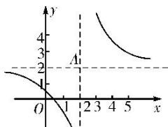

> [!faq]- 《专题10 函数图象的应用-函数》例题解析
>
> > [!success]- **【答案】** B
>
> > [!note]- **【分析】**
> > 本题未单列分析。
>
> > [!note]- **【解析】**
> > 答案 C 解析 将函数 $f(x)=x|x|-2x$ 去掉绝对值得 $f(x)=\left\{\begin{aligned}x^{2}-2x,&x\geq0,\\ -x^{2}-2x,&x<0,\end{aligned}\right.$ 画出函数 $f(x)$ 的图象，如图，
> > 
> > 观察图象可知，函数 $f(x)$ 的图象关于原点对称，故函数 $f(x)$ 为奇函数，且在 $(-1, 1)$ 上单调递减.
> > (2) 设函数 $y = \frac{2x - 1}{x - 2}$ ，关于该函数图象的命题如下：
> > - **①**：一定存在两点，这两点的连线平行于 $x$ 轴；
> > - **②**：任意两点的连线都不平行于 $y$ 轴；
> > - **③**：关于直线 $y = x$ 对称；
> > - **④**：关于原点中心对称.其中正确的是( )
> > A. ①② B. ②③ C. ③④ D. ①④
> > 答案 B 解析 $y=\frac{2x-1}{x-2}=\frac{2(x-2)+3}{x-2}=2+\frac{3}{x-2}$ ，图象如图所示，可知②③正确.
> > 
> > (3) 已知函数 $f(x) = \begin{cases} \log_2\left(-\frac{x}{2}\right), & x \leq -1, \\ -\frac{1}{3}x^2 + \frac{4}{3}x + \frac{2}{3}, & x > -1, \end{cases}$ 若 $f(x)$ 在区间 $[m, 4]$ 上的值域为 $[-1, 2]$ ，则实数 $m$ 的取值范围为 \_\_\_\_.
> > 答案 $[-8, -1]$ 解析 作出函数 $f(x)$ 的图象，当 $x \leq -1$ 时，函数 $f(x) = \log_2\left(-\frac{x}{2}\right)$ 单调递减，且最小值为 $f(-1) = -1$ ，则令 $\log_2\left(-\frac{x}{2}\right) = 2$ ，解得 $x = -8$ ；当 $x > -1$ 时，函数 $f(x) = -\frac{1}{3} x^2 + \frac{4}{3} x + \frac{2}{3}$ 在 $(-1, 2)$ 上单调递增，在 $[2, +\infty)$ 上单调递减，则最大值为 $f(2) = 2$ ，又 $f(4) = \frac{2}{3} < 2$ ， $f(-1) = -1$ ，故所求实数 $m$ 的取值范围为 $[-8, -1]$ .
> > 
> > (4) 对 $a, b \in \mathbf{R}$ , 记 $\max\{a, b\} = \begin{cases} a, & a \geq b, \\ b, & a < b, \end{cases}$ 函数 $f(x) = \max\{|x + 1|, |x - 2|\}(x \in \mathbf{R})$ 的最小值是 \_\_\_\_. 答案 $\frac{3}{2}$ 解析 函数 $f(x) = \max\{|x + 1|, |x - 2|\}(x \in \mathbf{R})$ 的图象如图所示，由图象可得，其最小值为 $\frac{3}{2}$ .
> > 
> > (5) 设函数 $f(x)$ 是定义在 $\mathbf{R}$ 上的偶函数，且对任意的 $x \in \mathbb{R}$ 恒有 $f(x + 1) = f(x - 1)$ ，已知当 $x \in [0, 1]$ 时， $f(x) = \left(\frac{1}{2}\right)^{1 - x}$ ，则说法：①2 是函数 $f(x)$ 的周期；
> > - **②**：函数 $f(x)$ 在 (1, 2) 上递减，在 (2, 3) 上递增；
> > - **③**：函数 $f(x)$ 的最大值是 1，最小值是 0；
> > - **④**：当 $x \in (3, 4)$ 时， $f(x) = \left(\frac{1}{2}\right)^{x - 3}$ .
> > 其中所有正确说法的序号是\_\_\_\_。
> > 答案 ①②④ 解析 由已知条件得 $f(x + 2) = f(x)$ ，所以 $y = f(x)$ 是以2为周期的周期函数，①正确；当 $-1 \leq x \leq 0$ 时， $0 \leq -x \leq 1$ ， $f(x) = f(-x) = \left(\frac{1}{2}\right)^{1 + x}$ ，函数 $y = f(x)$ 的图象如图所示：
> > 
> > 当 3<x<4 时，-1<x-4<0， $f(x)=f(x-4)=\left(\frac{1}{2}\right)x^{-3}$ ，因此②④正确，③不正确.
