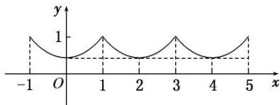

> [!faq]- 《专题10 函数图象的应用-函数》例题解析
>
> > [!success]- **【答案】** 详见解析
>
> > [!note]- **【分析】**
> > 本题未单列分析。
>
> > [!note]- **【解析】**
> > 答案 ①②④ 解析 由已知条件得 $f(x + 2) = f(x)$ ，所以 $y = f(x)$ 是以2为周期的周期函数，①正确；当 $-1 \leq x \leq 0$ 时， $0 \leq -x \leq 1$ ， $f(x) = f(-x) = \left(\frac{1}{2}\right)^{1 + x}$ ，函数 $y = f(x)$ 的图象如图所示：
> >
> > 
> >
> > 当 3<x<4 时，-1<x-4<0， $f(x)=f(x-4)=\left(\frac{1}{2}\right)x^{-3}$ ，因此②④正确，③不正确.
