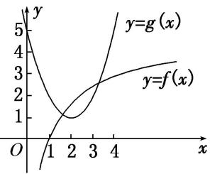

<!-- question-source:start -->
(2) = 2\ln 2 \in (1, 2)$ ，可知点(2, 1)位于函数 $f(x) = 2\ln x$ 图象的下方，故函数 $f(x) = 2\ln x$ 的图象与函数 $g(x) = x^2 - 4x + 5$ 的图象有2个交点.

(2) 已知函数 $f(x)$ 满足：①定义域为 $\mathbf{R}$ ；② $\forall x \in \mathbb{R}$ ，都有 $f(x + 2) = f(x)$ ；③当 $x \in [-1, 1]$ 时， $f(x) = -|x| + 1$ 。则方程 $f(x) = \frac{1}{2}\log_2|x|$ 在区间 $[-3, 5]$ 内解的个数是（）A. 5 B. 6 C. 7 D. 8
<!-- question-source:end -->

![[高中/总复习/专题/函数/专题10 函数图象的应用-函数/考点02_利用函数图象解决方程根的问题/例题/answers/Q00044390A1.md]]
