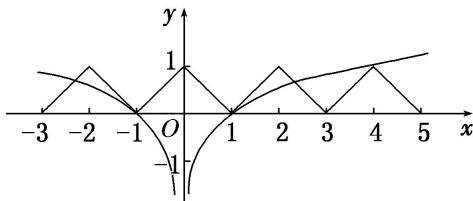

> [!faq]- 《专题10 函数图象的应用-函数》例题解析
>
> > [!success]- **【答案】** A
>
> > [!note]- **【分析】**
> > 本题未单列分析。
>
> > [!note]- **【解析】**
> > 答案 A 解析 依题意画出 $y = f(x)$ 与 $y = \frac{1}{2}\log_2|x|$ 的图象如图所示，由图可知，解的个数为5.
> >
> > 
