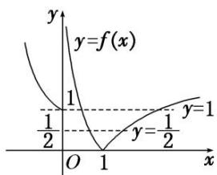

> [!faq]- 《专题10 函数图象的应用-函数》例题解析
>
> > [!success]- **【答案】** 详见解析
>
> > [!note]- **【分析】**
> > 本题未单列分析。
>
> > [!note]- **【解析】**
> > 答案 5 解析 方程 $2f^{2}(x)-3f(x)+1=0$ 的解为 $f(x)=\frac{1}{2}$ 或 $f(x)=1$ . 作出 $y=f(x)$ 的图象, 由图象知直线 $y=\frac{1}{2}$ 与函数 $y=f(x)$ 的图象有 2 个公共点; 直线 y=1 与函数 $y=f(x)$ 的图象有 3 个公共点. 故方程 $2f^{2}(x)-3f(x)+1=0$ 有 5 个解.
> > 
