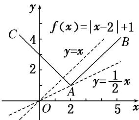

> [!faq]- 《专题10 函数图象的应用-函数》例题解析
>
> > [!success]- **【答案】** B
>
> > [!note]- **【分析】**
> > 本题未单列分析。
>
> > [!note]- **【解析】**
> > 答案 B 解析 先作出函数 $f(x)=|x-2|+1$ 的图象，如图所示，当直线 $g(x)=kx$ 与直线 AB 平行时斜率为 1，当直线 $g(x)=kx$ 过 A 点时斜率为 $\frac{1}{2}$ ，故 $f(x)=g(x)$ 有两个不相等的实根时，k 的取值范围为 $\left(\frac{1}{2}, 1\right)$ .
> >
> > 
