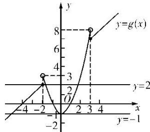

> [!faq]- 《专题10 函数图象的应用-函数》例题解析
>
> > [!success]- **【答案】** D
>
> > [!note]- **【分析】**
> > 本题未单列分析。
>
> > [!note]- **【解析】**
> > 答案 D 解析 令 $g(x) = (x^2 - 1) \odot (4 + x) = \begin{cases} 4 + x, & x \leq -2 \text{ 或 } x \geq 3, \\ x^2 - 1, & -2 < x < 3, \end{cases}$ 其图象如图所示.
> >
> > 
> >
> > $f(x)=g(x)+k$ 的图象与 x 轴恰有三个交点，即 $y=g(x)$ 与 y=-k 的图象恰有三个交点，由图可知 $-1<-k\leq2$ ，即 $-2\leq k<1$ 。
> >
> > 故选 **D**.
