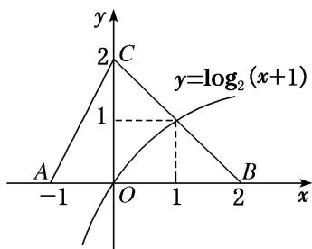

> [!faq]- 《专题10 函数图象的应用-函数》例题解析
>
> > [!success]- **【答案】** 详见解析
>
> > [!note]- **【分析】**
> > 本题未单列分析。
>
> > [!note]- **【解析】**
> > 答案 $\{x| - 1 < x \leq 1\}$ 解析令 $y = \log_2(x + 1)$ ，作出函数 $y = \log_2(x + 1)$ 图象如图所示。由 $\left\{ \begin{array}{l} x + y = 2, \\ y = \log_2(x + 1) \end{array} \right.$ 得 $\left\{ \begin{array}{l} x = 1, \\ y = 1. \end{array} \right.$ ∴结合图象知不等式 $f(x) \geq \log_2(x + 1)$ 的解集为 $\{x | -1 < x \leq 1\}$ 。
> > 
