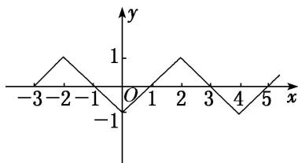

> [!faq]- 《专题10 函数图象的应用-函数》例题解析
>
> > [!success]- **【答案】** A
>
> > [!note]- **【解析】**
> > 答案 C 解析 作出函数 $f(x)$ 的图象如图所示．当 $x \in (-1, 0)$ 时，由 $xf(x) > 0$ 得 $x \in (-1, 0)$ ；当 $x \in (0, 1)$ 时，由 $xf(x) > 0$ 得 $x \in \emptyset$ ；当 $x \in (1, 3)$ 时，由 $xf(x) > 0$ 得 $x \in (1, 3)$ ．故 $x \in (-1, 0) \cup (1, 3)$ .
> >
> > 
