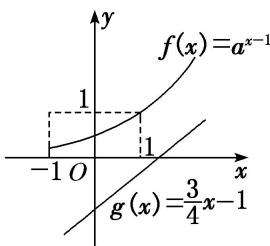
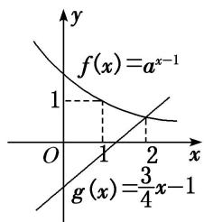

> [!faq]- 《专题10 函数图象的应用-函数》例题解析
>
> > [!success]- **【答案】** 详见解析
>
> > [!note]- **【解析】**
> > 答案 $\left[0, \frac{1}{2}\right]$ 解析 不等式 $4a^{x-1} < 3x - 4$ 等价于 $a^{x-1} < \frac{3}{4}x - 1$ . 令 $f(x) = a^{x-1}$ , $g(x) = \frac{3}{4}x - 1$ , 当 $a > 1$ 时, 在同一坐标系中作出两个函数的图象如图
> > (1)所示, 由图知不满足条件; 当 $0 < a < 1$ 时, 在同一坐标系中作出两个函数的图象如图
> > (2)所示, 当 $x \geq 2$ 时, $f (2) \leq g (2)$ , 即 $a^{2-1} \leq \frac{3}{4} \times 2 - 1$ , 解得 $a \leq \frac{1}{2}$ , 所以 $a$ 的取值范围是 $\left[0, \frac{1}{2}\right]$ .
> >
> >   
> > 图
> > （1）
> >
> >   
> > 图
> > （2）
> >
> > ## 【对点训练】
