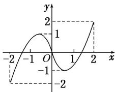
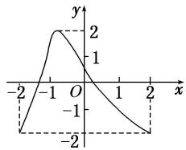

<!-- question-source:start -->
14. 已知函数 $y = f(x)$ 及 $y = g(x)$ 的图象分别如图所示, 方程 $f(g(x)) = 0$ 和 $g(f(x)) = 0$ 的实根个数分别为 $a$ 和 $b$ , 则 $ab = (\quad)$

  
$y = f(x)$

  
$y = g(x)$

A. 24 B. 15 C. 6 D. 4
<!-- question-source:end -->

![[高中/总复习/专题/函数/专题10 函数图象的应用-函数/考点03_利用函数图象解不等式/对点训练/answers/Q00041025A1.md]]
